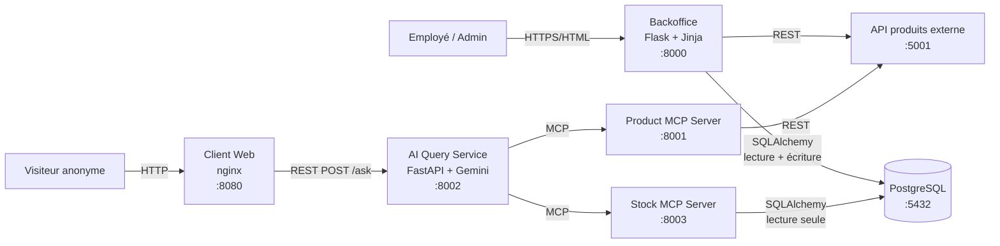

# HBNtory - Système de gestion d'inventaire

HBNtory gère le stock d'une entreprise de vente au détail répartie sur
plusieurs succursales.

Le projet comporte deux applications destinées aux utilisateurs :

- un **Backoffice** authentifié, pour les employés et l'administrateur ;
- un **Client Web** public, où n'importe qui peut poser des questions en
  langage naturel sur les produits et le stock.

Les données produit (noms, prix, descriptions, images) ne sont **jamais
stockées localement** : elles viennent d'une API produits externe fournie
par Holberton. La base de données ne contient que les utilisateurs, les
succursales et les quantités de stock rattachées à un identifiant produit.

L'assistant du Client Web n'accède ni à la base ni à l'API directement :
il passe par deux serveurs **MCP** (Model Context Protocol) qui exposent
des outils en lecture seule.

## Membres de l'équipe

| Membre | GitHub |
|---|---|
| Vadim Gavet | [@Chihaan](https://github.com/Chihaan) |
| Madi Anli Madi | [@madi-spec49](https://github.com/madi-spec49) |
| Adib | [@adib-commits](https://github.com/adib-commits) |

## Architecture



Sept services, une responsabilité chacun :

| Service | Rôle |
|---|---|
| **Backoffice** | Le seul service autorisé à **écrire** le stock. Authentification, gestion des utilisateurs, opérations de stock. |
| **PostgreSQL** | Utilisateurs, succursales, quantités de stock. Aucune donnée produit. |
| **API produits externe** | Fournie par Holberton, en lecture seule. Source unique de vérité pour les produits. |
| **Product MCP Server** | Expose l'API produits à l'agent IA sous forme d'outils MCP. |
| **Stock MCP Server** | Expose le stock à l'agent IA en **lecture seule**, via un rôle PostgreSQL dédié. |
| **AI Query Service** | Reçoit les questions, laisse l'agent Gemini choisir les outils MCP, renvoie une réponse en français. |
| **Client Web** | Page publique : une question, une réponse. |

Détail complet dans [`docs/architecture.md`](docs/architecture.md).

## Prérequis

- **Docker** et **Docker Compose v2**, démarrés (Docker Desktop ou OrbStack).
- Une **clé API Gemini**, gratuite sur [aistudio.google.com/apikey](https://aistudio.google.com/apikey).
  Elle est **obligatoire** : sans elle, le conteneur `ai-service` s'arrête
  au démarrage (`ValueError: No API key was provided.`, levée à l'import
  d'`agent.py`) et `docker compose ps` n'affiche que 6 services sur 7. Les
  six autres - dont le Backoffice - fonctionnent normalement.

Vérification rapide :

```bash
docker compose version
```

## Installation

```bash
git clone https://github.com/Chihaan/HBNtory.git
cd HBNtory
cp .env.exemple .env
```

Ouvre ensuite `.env` et renseigne **trois secrets**, répartis sur quatre
variables (le mot de passe MCP apparaît deux fois) :

```bash
# 1. Clé de signature des cookies de session
python3 -c "import secrets; print(secrets.token_hex(32))"

# 2. Mot de passe du rôle PostgreSQL en lecture seule
python3 -c "import secrets; print(secrets.token_urlsafe(24))"
```

| Variable | Valeur à mettre |
|---|---|
| `SECRET_KEY` | le résultat de la commande 1 |
| `MCP_DB_PASSWORD` | le résultat de la commande 2 |
| `MCP_DATABASE_URL` | **le même** mot de passe, à la place de `readonly-changeme` |
| `GEMINI_API_KEY` | ta clé Gemini |

> Le mot de passe MCP apparaît **deux fois** dans le fichier
> (`MCP_DB_PASSWORD` et à l'intérieur de `MCP_DATABASE_URL`). Les deux
> doivent être identiques, sinon le Stock MCP Server ne pourra pas se
> connecter.

## Lancer le projet

Une seule commande lance les sept services :

```bash
./run-dev.sh
```

Le script vérifie que `.env` existe, que Docker tourne (et le démarre sur
macOS si besoin), que `docker-compose.yml` est valide, prévient si
`GEMINI_API_KEY` est vide, puis exécute `docker compose up --build`.

Équivalent manuel :

```bash
docker compose up --build
```

Pour arrêter : `Ctrl+C`, ou `docker compose down` depuis un autre terminal.

### Adresses

| Service | Depuis ta machine | Depuis un conteneur |
|---|---|---|
| Client Web | http://localhost:8080 | `client-web:80` |
| Backoffice | http://localhost:8000 | `backoffice:8000` |
| AI Query Service | http://localhost:8002 | `ai-service:8002` |
| Product MCP Server | http://localhost:8001/mcp | `mcp-server:8001/mcp` |
| Stock MCP Server | http://localhost:8003/mcp | `stock-mcp-server:8003/mcp` |
| API produits externe | http://localhost:5001 | `external-products-api:5000` |
| PostgreSQL | localhost:5432 | `db:5432` |

> À l'intérieur d'un conteneur, `localhost` désigne le conteneur lui-même.
> Le code utilise donc toujours le **nom du service** Docker.

### Lancer un service seul

Chaque service est indépendant, utile pour déboguer :

```bash
docker compose up db external-products-api   # base + API produits
docker compose up backoffice                 # + ses dépendances
docker compose up stock-mcp-server
docker compose logs -f ai-service            # suivre les logs d'un service
```

## Initialisation de la base de données

**Elle est automatique.** Au démarrage du conteneur `backoffice`,
`docker-entrypoint.sh` lance `bootstrap.py`, qui :

1. crée les tables manquantes (`branches`, `users`, `stock`) ;
2. crée ou met à jour le rôle PostgreSQL en lecture seule `mcp_reader` ;
3. **si et seulement si la base ne contient aucun utilisateur**, insère les
   données de démonstration (3 succursales, 3 comptes, 36 lignes de stock).

Une base déjà remplie n'est jamais écrasée : le message
`Données existantes conservées.` apparaît dans les logs.

### Commandes manuelles

```bash
# Recréer le schéma + le rôle mcp_reader, sans toucher aux données
docker compose run --rm backoffice python init_db.py

# Forcer la réinsertion des données de démo (ÉCRASE stock et utilisateurs)
docker compose run --rm backoffice python seed.py

# Repartir de zéro (ATTENTION : supprime le volume PostgreSQL)
docker compose down -v && ./run-dev.sh
```

### Inspecter la base

```bash
docker compose exec db psql -U hbntory -d hbntory
```

```sql
\dt                      -- lister les tables
SELECT * FROM branches;
\q
```

## Accéder au Backoffice

Ouvre **http://localhost:8000** -> redirection vers la page de connexion.

Comptes créés par le seed (mots de passe pilotés par `.env`) :

| Identifiant | Rôle | Succursale | Mot de passe |
|---|---|---|---|
| `admin` | Administrateur | aucune | `ADMIN_PASSWORD` (défaut `ChangeMe123!`) |
| `marie` | Employée | Fréjus Centre | `SEED_USER_PASSWORD` (défaut `Test123!`) |
| `paul` | Employé | Laval Gare | `SEED_USER_PASSWORD` (défaut `Test123!`) |

> Ce sont des comptes de **démonstration**. Les mots de passe par défaut
> sont volontairement visibles ici ; en production, `.env` fournit les
> vrais. Le seed affiche un avertissement si `ADMIN_PASSWORD` n'est pas
> défini.

Après connexion, chaque rôle arrive sur sa page - et n'a accès qu'à
celle-là :

- **`admin`** -> `/users` : lister, créer, désactiver, réactiver,
  supprimer (soft delete) des employés, changer leur mot de passe ou leur
  succursale. L'admin **ne peut pas** toucher au stock (403).
- **`marie` / `paul`** -> `/stock` : le stock de **leur** succursale
  uniquement, enrichi des noms et prix venus de l'API produits, avec les
  boutons d'ajout et de retrait. Un employé **ne peut pas** gérer les
  utilisateurs (403).

Ces restrictions sont appliquées côté serveur, pas seulement en masquant
des boutons - voir [`docs/security.md`](docs/security.md).

## Utiliser le Client Web

Ouvre **http://localhost:8080**, tape une question, clique sur *Envoyer*.
Un indicateur « Recherche... » s'affiche pendant le traitement, puis la
réponse apparaît. Aucune connexion n'est requise.

Quatre familles de questions sont couvertes :

| Type | Exemple |
|---|---|
| Détails d'un produit | « Donne-moi les détails du Holberton Student Laptop 14 » |
| Où trouver un produit | « Quelle succursale a le Holberton Student Laptop 14 en stock ? » |
| Contenu d'une succursale | « Quels produits sont disponibles à Fréjus ? » |
| Liste d'achats | « Je veux 2 Holberton Student Laptop 14 et 1 External SSD 1TB, dans quelle succursale aller ? » |

> **Nommer les produits comme le catalogue les nomme.** La recherche de
> l'API produits est une simple **sous-chaîne** sur le nom, le SKU, la
> description et les tags - et le catalogue est en anglais. « laptop 14 »
> trouve le bon produit, « laptop 14 pouces » ne trouve **rien**. En
> démonstration, reprendre le nom exact.

L'agent répond « je ne peux pas vous aider » si la question sort du
périmètre produits/stock, et signale clairement une information
indisponible plutôt que de l'inventer. Détail dans
[`ai_service/QUESTION_TYPES.md`](ai_service/QUESTION_TYPES.md).

Test en ligne de commande, sans navigateur :

```bash
curl -X POST http://localhost:8002/ask \
  -H "Content-Type: application/json" \
  -d '{"question": "Quels produits sont disponibles à Fréjus ?"}'
```

La réponse contient `answer` (le texte) et `tool_calls` (la trace des
outils MCP appelés - pratique pour vérifier que l'agent s'appuie bien sur
de vraies données).

## Décisions techniques principales

| Décision | Raison |
|---|---|
| **Backoffice en SSR** (Flask + Jinja) | Des écrans CRUD internes n'ont pas besoin d'une SPA. Presque pas de JavaScript, intégration directe avec SQLAlchemy. Compromis : chaque action recharge la page. |
| **REST entre Client Web et AI Service** | Chaque question est indépendante, sans historique à maintenir. WebSocket ne se justifierait que pour du streaming. Compromis : pas de réponse token par token. |
| **MCP entre AI Service et les données** | L'agent ne connaît ni SQL ni l'URL de l'API : il ne voit que des outils. Les sources peuvent évoluer sans toucher à l'agent. Compromis : une couche de plus. |
| **Argon2 pour les mots de passe** | Fonction conçue pour le stockage de mots de passe (lente, salée, coûteuse en mémoire). SHA-256 seul serait cassable par force brute massive. |
| **Sessions plutôt que JWT** | Le Backoffice est rendu côté serveur : le cookie signé est natif, et une session peut être révoquée immédiatement - un employé supprimé perd l'accès à la requête suivante. |
| **Validation du stock dans la couche service** | Seul endroit qui voit à la fois *qui agit* et *ce qui est écrit*. Les vues ne feraient que répéter la règle, le modèle ne peut pas appeler l'API externe. |
| **`branch_id` jamais en paramètre** | La succursale est toujours déduite de l'utilisateur connecté. Un employé ne peut pas modifier le stock d'une autre succursale : il n'y a aucun champ à falsifier. |
| **Rôle PostgreSQL `mcp_reader`** | Le Stock MCP Server, interrogé par des anonymes, se connecte avec un compte qui n'a que `SELECT` sur `branches` et `stock`, et **aucun accès à `users`**. La restriction est structurelle, pas applicative. |
| **Pas de donnée produit en local** | Le stock ne stocke qu'un `product_id`. Aucune duplication à resynchroniser, l'API reste la source de vérité. |

Justifications détaillées : [`docs/architecture.md`](docs/architecture.md),
[`docs/security.md`](docs/security.md),
[`docs/validation.md`](docs/validation.md).

## Limitations connues

- **La validation des `product_id` est prospective.** Elle empêche
  l'entrée de nouveaux identifiants invalides, mais ne détecte pas ceux
  déjà présents (notamment ceux insérés par le seed).
- **Pas d'historique des mouvements de stock.** On connaît la quantité
  actuelle, pas qui l'a modifiée ni quand. Seuls `created_at` et
  `updated_at` existent.
- **Pas de mémoire conversationnelle.** Chaque question est traitée
  isolément : « et à Laval ? » après une première question ne fonctionne
  pas.
- **`SESSION_COOKIE_SECURE` est désactivé par défaut**, pour permettre le
  dev en HTTP. À activer via l'environnement pour un déploiement HTTPS.
- **CORS ouvert (`*`) sur l'AI Query Service**, parce que le Client Web
  est servi depuis une autre origine (port 8080). À restreindre en
  production.
- **La CI ne teste que le Backoffice.** Les serveurs MCP et l'AI Service
  sont couverts par des tests manuels documentés, pas automatisés.
- **Pas de rate limiting** sur `/ask` : chaque question consomme du quota
  Gemini.
- **Le dépassement de quota Gemini n'est pas géré.** L'offre gratuite est
  limitée à 15 requêtes par minute ; au-delà, l'erreur HTTP 429 du
  fournisseur remonte non capturée et `/ask` retourne un HTTP 500. Le Client
  Web affiche alors « Impossible de contacter le AI Query Service. », ce qui
  est trompeur : le service a répondu, c'est le fournisseur qui a refusé.
  Rencontré en conditions réelles pendant les tests. C'est la correction à
  faire en premier sur l'AI Query Service.
- **L'admin est protégé mais unique.** Il ne peut être ni supprimé, ni
  désactivé, ni modifié via l'interface - et aucun second admin ne peut
  être créé depuis le Backoffice.
- **`client-web-interface/nginx.conf` n'est pas utilisé** par
  `docker-compose.yml`, qui monte le dossier dans une image `nginx:alpine`
  standard. Le navigateur appelle donc directement
  `http://localhost:8002/ask`.

## Fonctionnalités optionnelles réalisées

- **Docker Compose pour l'ensemble des services**, plus `run-dev.sh` qui
  vérifie l'environnement avant de lancer la stack.
- **Suite de tests automatisée** : 92 tests unitaires et d'intégration
  (100 % au vert, 87 % de couverture du code applicatif) et 12 tests
  end-to-end Playwright.
- **Intégration continue GitHub Actions** : norme PEP 8, tests sur SQLite
  *et* sur PostgreSQL réel, tests E2E.
- **Activation / désactivation** de comptes, distincte du soft delete.
- **Protection contre l'énumération de comptes par mesure du temps de
  réponse** (`waste_time()` dans `services/auth.py`).
- **Interface soignée et responsive**, avec KPIs, modales, filtres par
  catégorie et dégradation gracieuse si l'API produits tombe.
- **Trace des appels d'outils** (`tool_calls`) renvoyée par `/ask`, pour
  observer le raisonnement de l'agent.

## Tests

```bash
cd backoffice
pip install -r requirements-dev.txt
pytest -q                                    # 92 tests
pytest --cov=. --cov-report=term-missing     # avec couverture
```

Preuves complètes, correspondance avec les scénarios de la consigne et
tests des serveurs MCP : [`docs/testing.md`](docs/testing.md).

## Documentation

| Document | Contenu |
|---|---|
| [`docs/architecture.md`](docs/architecture.md) | Services, communication, stratégies, MVP |
| [`docs/database.md`](docs/database.md) | Schéma relationnel, ERD, dictionnaire des champs |
| [`docs/security.md`](docs/security.md) | Authentification, hachage, autorisation |
| [`docs/validation.md`](docs/validation.md) | Règles de validation du stock |
| [`docs/testing.md`](docs/testing.md) | Preuves de tests, scénarios critiques |
| [`docs/docker_build.md`](docs/docker_build.md) | Guide Docker détaillé et dépannage |
| [`docs/presentation.md`](docs/presentation.md) | Plan de présentation et scénario de démo |
| [`docs/commits.md`](docs/commits.md) | Convention de commits |
| [`ai_service/QUESTION_TYPES.md`](ai_service/QUESTION_TYPES.md) | Types de questions supportées |
| [`client-web-interface/README.md`](client-web-interface/README.md) | Client Web : contrat d'API, questions d'exemple, limites |
| [`product_mcp_server/tests/test_manual.md`](product_mcp_server/tests/test_manual.md) | Tests manuels du Product MCP Server |
| [`stock_mcp_server/tests/test_manual.md`](stock_mcp_server/tests/test_manual.md) | Tests manuels du Stock MCP Server |

> `external/product-api/docs/openapi.yaml` décrit l'API produits externe.
> Ce fichier fait partie de l'API **fournie par Holberton** : nous ne
> l'avons pas écrit, mais il est utile pour vérifier un paramètre ou un
> format de réponse.
