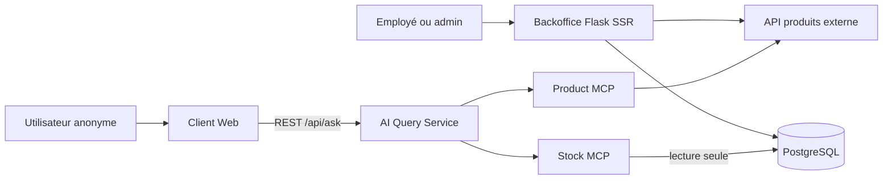

# HBNtory

HBNtory est un système de gestion d'inventaire pour une entreprise fictive
possédant plusieurs succursales. Il réunit un Backoffice authentifié pour les
équipes internes et une interface publique permettant d'interroger les produits
et les stocks en langage naturel.

Le projet sépare volontairement les responsabilités :

- le Backoffice gère les utilisateurs et les quantités de stock ;
- PostgreSQL conserve uniquement les données locales ;
- l'API produits externe reste la source de vérité du catalogue ;
- deux serveurs MCP donnent à l'agent IA un accès contrôlé aux produits et aux
  stocks ;
- le service IA répond aux questions du client web sans accès direct aux
  sources de données.

## Équipe

Les responsabilités ci-dessous reprennent les composants présents dans
l'historique Git.

| Membre | Contribution principale |
| --- | --- |
| Vadim Gavet | Backoffice, intégration, tests et coordination technique |
| Adib | Client Web Interface |
| Madi | Product MCP Server et Stock MCP Server |
| Gwendal | première version de l'AI Query Service |

## Architecture



| Service | Responsabilité | Port local |
| --- | --- | --- |
| `backoffice` | authentification, utilisateurs et stock | `8000` |
| `db` | utilisateurs, succursales et quantités | `5432` |
| `external-products-api` | catalogue produits en lecture seule | `5001` |
| `mcp-server` | outils MCP du catalogue | `8001` |
| `stock-mcp-server` | outils MCP de stock en lecture seule | `8003` |
| `ai-service` | traitement des questions et orchestration des outils | `8002` |
| `client-web` | interface publique et proxy vers le service IA | `8080` |

La description complète et les décisions d'architecture sont dans
[`docs/architecture.md`](docs/architecture.md).

## Choix techniques principaux

- **Backoffice : Flask avec rendu côté serveur.** Les opérations sont des
  formulaires CRUD simples ; le rendu SSR limite le JavaScript et centralise
  l'autorisation côté serveur.
- **Client public : REST.** Chaque question est indépendante et aucune mémoire
  de conversation n'est demandée. Les WebSockets et le streaming ne sont donc
  pas nécessaires au MVP.
- **Base : PostgreSQL et SQLAlchemy.** Le schéma impose les relations, l'unicité
  d'un stock par couple succursale-produit et les limites de quantité.
- **Mots de passe : Argon2.** Les mots de passe ne sont jamais stockés en clair.
- **Accès IA : MCP.** L'agent ne se connecte directement ni à PostgreSQL ni à
  l'API produits.
- **Stock public en lecture seule.** Le Stock MCP emploie un rôle PostgreSQL
  dédié qui ne peut lire que `branches` et `stock`.

## Prérequis

- Docker Desktop ou OrbStack avec Docker Compose v2 ;
- une clé API Groq valide pour les questions IA ;
- `curl` pour les vérifications manuelles.

## Installation

Depuis la racine du dépôt :

```bash
cp .env.exemple .env
```

Dans `.env`, remplacer au minimum :

- `SECRET_KEY` ;
- `POSTGRES_PASSWORD` et le mot de passe correspondant dans `DATABASE_URL` ;
- `MCP_DB_PASSWORD` et le mot de passe correspondant dans
  `MCP_DATABASE_URL` ;
- `GROQ_API_KEY` ;
- les mots de passe de démonstration si les valeurs proposées ne conviennent
  pas.

Des secrets peuvent être générés avec :

```bash
python3 -c "import secrets; print(secrets.token_hex(32))"
python3 -c "import secrets; print(secrets.token_urlsafe(24))"
```

Ne jamais committer le fichier `.env`.

## Lancement

Le script de développement construit et démarre toute la stack :

```bash
./run-dev.sh
```

Pour lancer en arrière-plan :

```bash
docker compose up --build -d
docker compose ps
```

Pour arrêter sans supprimer les données :

```bash
docker compose down
```

Les interfaces sont ensuite accessibles ici :

- Backoffice : <http://localhost:8000>
- Client Web : <http://localhost:8080>
- AI Query Service : <http://localhost:8002>
- API produits : <http://localhost:5001>

## Initialisation de la base

Au démarrage, le conteneur Backoffice :

1. crée les tables manquantes ;
2. configure le rôle PostgreSQL en lecture seule du Stock MCP ;
3. complète les données de démonstration absentes sans écraser les données
   existantes.

La seed crée au minimum :

- l'administrateur `admin` ;
- les employés de démonstration `marie` et `paul` ;
- les succursales Fréjus Centre, Laval Gare et Toulouse Capitole ;
- un jeu de stock permettant de tester les questions mono et multi-produits.

Les mots de passe viennent de `ADMIN_PASSWORD` et `SEED_USER_PASSWORD` dans
`.env`. Pour relancer la fusion sans suppression :

```bash
docker compose exec backoffice python seed.py
```

La réinitialisation suivante supprime les données applicatives avant de recréer
la démonstration ; elle ne doit être utilisée que volontairement :

```bash
docker compose exec backoffice python seed.py --reset
```

## Utilisation du Backoffice

- L'administrateur peut lister, créer, modifier, désactiver et soft-delete les
  utilisateurs communs.
- Un utilisateur commun est rattaché à exactement une succursale.
- Un utilisateur commun peut consulter, ajouter et retirer du stock uniquement
  dans sa succursale.
- L'administrateur ne peut pas modifier le stock.
- Un utilisateur supprimé ou désactivé ne peut plus se connecter.

Les noms, descriptions, prix, catégories et SKU affichés par le Backoffice sont
récupérés depuis l'API produits ; seule la référence numérique `product_id` est
conservée avec le stock.

## Utilisation du Client Web

Le client est public et ne demande aucune authentification. Exemples :

- « Donne-moi les détails du produit 12. »
- « Dans quelles succursales puis-je trouver un ordinateur portable ? »
- « Quels produits sont disponibles à Fréjus ? »
- « Où acheter 3 laptops, 2 écrans et 4 claviers ? »

Chaque question est indépendante. Le périmètre exact, le comportement
hors-sujet et la stratégie de grounding sont décrits dans
[`docs/ai-query-service.md`](docs/ai-query-service.md).

## Tests

Les commandes principales sont :

```bash
# Tests locaux par service, après installation de requirements-dev.txt
(cd backoffice && pytest -q)
(cd product_mcp_server && pytest -q)
(cd stock_mcp_server && pytest -q)
(cd ai_service && pytest -q)

# Vérification du trajet Client Web -> Nginx -> AI Service, sans quota Groq
./smoke-test.sh

# Vérification avec une vraie question IA
./smoke-test.sh --avec-ia
```

La matrice des scénarios critiques et la procédure de validation finale sont
dans [`docs/testing.md`](docs/testing.md).

## Documentation

- [Architecture et décisions](docs/architecture.md)
- [Schéma de base de données](docs/database-schema.md)
- [Authentification et autorisation](docs/authentication.md)
- [Périmètre de l'AI Query Service](docs/ai-query-service.md)
- [Règles de validation du stock](docs/validation.md)
- [Installation et diagnostic Docker](docs/docker_build.md)
- [Tests et validation d'intégration](docs/testing.md)
- [Trame de présentation et démonstration](docs/presentation.md)

## Limitations connues

- Les réponses IA dépendent de la disponibilité et du quota de Groq.
- Le client attend une réponse complète : il n'y a ni streaming ni WebSocket.
- Il n'y a pas de mémoire de conversation ; chaque requête est indépendante.
- L'algorithme de répartition d'une liste d'achats produit un plan valide et
  déterministe, mais ne garantit pas toujours le nombre minimal de
  succursales.
- La validation d'existence d'un produit est effectuée lors de la création
  d'une nouvelle ligne de stock. Elle ne réaudite pas automatiquement les
  anciennes lignes insérées hors du service Backoffice.
- Le projet n'implémente ni historique des mouvements, ni journal d'audit, ni
  limitation de débit.

## Fonctionnalités optionnelles déjà ajoutées

- Docker Compose pour l'ensemble de la stack ;
- rôle PostgreSQL dédié au Stock MCP ;
- tests automatisés et tests E2E Backoffice ;
- protection CSRF et durcissement des cookies ;
- interface Backoffice améliorée ;
- journalisation des appels MCP et budgets de timeout cohérents.
