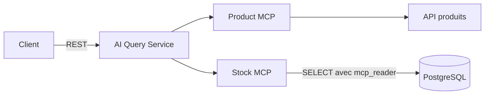

# AI Query Service

## Responsabilité

L'AI Query Service est un service FastAPI indépendant du Backoffice. Il reçoit
une question anonyme, orchestre un agent et renvoie une réponse textuelle.

```http
POST /ask
Content-Type: application/json

{"question": "Quels produits sont disponibles à Fréjus ?"}
```

Réponse :

```json
{"answer": "Texte fondé sur les données retournées par les outils."}
```

Chaque requête est indépendante. Le service ne conserve ni compte utilisateur,
ni historique de conversation, ni mémoire entre deux questions.

## Types de questions supportés

### 1. Détails d'un produit

Exemples :

- « Donne-moi les détails du produit 12. »
- « Quel est le prix du Holberton Student Laptop 14 ? »

Outils attendus :

1. `products_list_products` si le produit doit être identifié par son nom ;
2. `products_get_product_details` avec son identifiant numérique.

### 2. Disponibilité d'un produit entre les succursales

Exemples :

- « Où puis-je trouver le produit 3 ? »
- « Combien de laptops sont disponibles et dans quelles boutiques ? »

Outils attendus :

1. Product MCP pour identifier le produit ;
2. `stock_get_stock_by_product`.

### 3. Produits disponibles dans une succursale

Exemples :

- « Quels produits sont disponibles à Fréjus ? »
- « Que puis-je acheter dans la succursale Laval Gare ? »

Outils attendus dans le même tour :

- `stock_get_stock_by_branch_name` pour obtenir uniquement les produits dont la
  quantité est strictement positive ;
- `products_list_products` pour associer les identifiants aux données du
  catalogue.

Le catalogue ne constitue jamais une preuve de disponibilité : seuls les
`product_id` retournés par le Stock MCP peuvent être affichés comme présents
dans la succursale.

### 4. Liste d'achats et recommandation de succursales

Exemple :

- « Je veux 3 laptops, 2 écrans et 4 claviers. Quelle succursale dois-je
  visiter ? »

Outils attendus :

1. Product MCP pour résoudre chaque nom en `product_id` ;
2. `stock_check_availability` avec des quantités strictement positives.

L'outil privilégie une succursale unique lorsqu'elle peut satisfaire toute la
commande. Sinon, il fournit un plan de retrait sur plusieurs succursales et
signale explicitement les quantités impossibles à couvrir.

## Questions hors périmètre

Le service ne prend pas en charge :

- la création de commandes ou de réservations ;
- les achats et paiements ;
- la modification de stock ;
- la gestion des utilisateurs ;
- les horaires, itinéraires ou coordonnées non présents dans les outils ;
- les questions générales sans rapport avec les produits ou l'inventaire.

Pour une question hors périmètre, la réponse doit expliquer brièvement que
l'assistant répond uniquement aux questions de catalogue et de disponibilité.
Il ne doit pas utiliser ses connaissances générales pour compléter une donnée
absente.

## Accès aux données

L'agent ne possède aucun accès direct aux sources.



Le Product MCP expose :

- `list_products` ;
- `get_product_details`.

Le Stock MCP expose :

- `find_branches` ;
- `get_stock_by_branch_name` ;
- `get_stock_by_product` ;
- `get_stock_by_branch` ;
- `check_availability`.

Tous les outils de stock sont en lecture seule.

## Grounding et prévention des inventions

Le premier tour de l'agent impose l'utilisation d'au moins un outil. La réponse
doit être construite uniquement à partir des résultats MCP.

L'agent ne doit jamais inventer :

- un produit ou un identifiant ;
- un nom, un prix ou une description ;
- une quantité ;
- une succursale ;
- une disponibilité.

Un résultat vide est une donnée valide : par exemple, un produit connu peut ne
se trouver dans aucune succursale. Une erreur `success: false` signifie au
contraire que la source n'a pas pu répondre. L'agent doit distinguer ces deux
cas et expliquer l'indisponibilité de l'information en cas d'erreur.

## Communication avec le Client Web

Le projet utilise REST plutôt que WebSocket :

- chaque question est indépendante ;
- aucune communication bidirectionnelle continue n'est nécessaire ;
- le contrat HTTP est simple à tester et à placer derrière Nginx.

La limitation est l'absence de streaming : le client attend la réponse entière.
Les budgets sont ordonnés pour que l'erreur la plus interne reste lisible :

```text
AI Query Service : 60 s
Nginx            : 75 s
Navigateur       : 90 s
```

## Observabilité

Chaque question reçoit un identifiant technique court dans les journaux.
Pour chaque outil, le service journalise :

- le nom de l'outil ;
- le succès ou l'échec ;
- la durée.

Les arguments, la question, les réponses, les secrets et les chaînes de
connexion ne sont pas recopiés dans les logs.

## Erreurs publiques

| Situation | Statut | Comportement |
| --- | --- | --- |
| question vide ou trop longue | `422` | erreur de validation |
| quota ou limite fournisseur | `429` | délai de nouvelle tentative lisible |
| budget global dépassé | `504` | invitation à simplifier la question |
| agent, modèle ou MCP indisponible | `503` | message générique sans détail sensible |

## Limites connues

- Les réponses dépendent du choix d'outils effectué par le modèle.
- Le service dépend d'un fournisseur IA externe et de son quota.
- La boucle est limitée à quatre tours d'outils.
- La répartition multi-succursales est valide et déterministe, mais son
  heuristique gloutonne ne garantit pas toujours le nombre minimal d'arrêts.
- Les produits discontinués encore présents en stock doivent rester
  identifiables par le Product MCP ; ce scénario fait partie de la validation
  finale.
