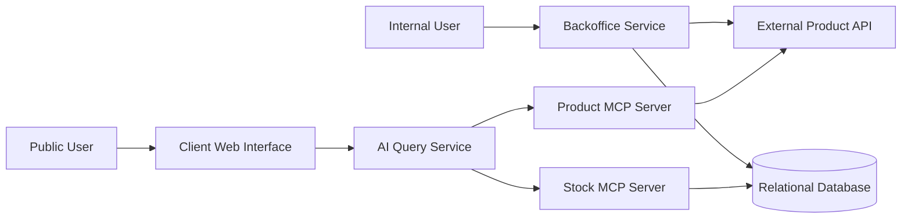

# Inventory Management System - Architecture Document

# Overview

The system manages stock for a fictional retail company with multiple branches.

It contains two main user-facing applications:

- A Backoffice for authenticated internal users.
- A public Client Web Interface for natural-language product and stock questions.

The system is divided into independent services so that stock management, product access and AI queries remain separated.

# High-Level Architecture

## 1. Services

### 1.1 Backoffice Service

The backoffice service is an authenticated internal web application.

Its responsibilities are:

Authenticating internal users.
Managing users and permissions.
Managing stock quantities.
Restricting common users to their assigned branch.
Allowing the administrator to manage common users.
Retrieving product information from the external Product API.
The Backoffice Service is the only user-facing service allowed to modify stock data.

The service uses SQLAlchemy to communicate with the relational database.

### 1.2 Relational Database

The relational database stores all local data required by the inventory management system.

Its responsibilities are:

Storing user accounts and authentication information.
Storing branch information.
Storing stock quantities for each product and branch.
Enforcing relationships between users, branches, and stock records.
Ensuring stock quantities remain consistent and never become negative.

The database does not store product names, descriptions, prices, images, or any other product metadata. 

It only stores product identifiers associated with stock records.

### 1.3 External Product API

The External Product API is a read-only service provided as a Docker container.

Its responsibilities are:

Providing the list of available products.
Returning detailed information about a specific product.
Acting as the single source of truth for product data.

The Product API does not manage stock quantities or users. 

All product information displayed by the system is retrieved from this service.

### 1.4 Product MCP Server

The Product MCP Server acts as a bridge between the AI Query Service and the External Product API.

Its responsibilities are:

Exposing tools for listing available products.
Exposing tools for retrieving product details.
Forwarding requests from AI agents to the Product API.
Returning structured product information to the AI Query Service.

The Product MCP Server abstracts the communication with the Product API, allowing AI agents to access product information through MCP tools instead of calling the API directly.

### 1.5 Stock MCP Server

The Stock MCP Server provides controlled access to stock information stored in the relational database.

Its responsibilities are:

Exposing tools for querying stock quantities.
Retrieving stock availability for a specific product.
Retrieving products available in a specific branch.
Providing stock information to AI agents.
Preventing direct database access from AI agents.

The Stock MCP Server acts as a secure interface between the AI Query Service and the relational database.

### 1.6 AI Query Service

The AI Query Service is an independent backend service responsible for processing natural-language queries from users.

Its responsibilities are:

Receiving questions from the Client Web Interface.
Interpreting user requests using one or more AI agents.
Retrieving product information through the Product MCP Server.
Retrieving stock information through the Stock MCP Server.
Combining information from multiple sources to generate accurate responses.
Informing users when the requested information is unavailable.

The AI Query Service does not directly communicate with the Product API or the database. 

Instead, it relies on MCP tools to access external information.

### 1.7 Client Web Interface

The Client Web Interface is the public entry point for anonymous users.

Its responsibilities are:

Providing a simple interface for asking inventory-related questions.
Sending user queries to the AI Query Service.
Displaying AI-generated responses.
Allowing users to search for product and stock information without authentication.

The Client Web Interface does not access the database or the Product API directly. 

All requests are handled through the AI Query Service.

## 1.1.0 Communication with services

### 1.1.1 Backoffice Service

Communicates with the Relational Database through SQLAlchemy to manage users, branches, and stock quantities.

And

Communicates with the External Product API through REST requests to retrieve product information when displaying products.

### 1.1.2 Client Web Interface

Sends user queries to the AI Query Service using a REST API.

### 1.1.3 AI Query Service

Communicates with the Product MCP Server to retrieve product information.

And

Communicates with the Stock MCP Server to retrieve stock information.

### 1.1.4 Product MCP Server

Communicates with the External Product API through REST requests.

### 1.1.5 Stock MCP Server

Communicates with the Relational Database using SQLAlchemy to retrieve stock data.

This separation ensures that each service has a single responsibility and can evolve independently.

### 1.1.5 Local Data Storage

The locally stored data includes:

User accounts.
Password hashes.
User roles.
Branch information.
User-to-branch assignments.
Stock quantities.
Product identifiers associated with stock records.

The application does not store product names, descriptions, prices, images, or other product metadata.

### 1.1.6 External Product Data

All product information is provided by the External Product API.

This data includes:

Product names.
Product descriptions.
Product prices.
Product images.
Product categories.
Other product metadata.

The Product API acts as the single source of truth for all product-related information. Whenever product details are required, the application retrieves them from this service instead of storing them locally.

### 1.1.7 AI Agent Data Access

The AI agent does not directly access the database or the External Product API.

Instead, it relies on MCP servers to retrieve the required information.

The AI agent accesses:

Product information through the Product MCP Server, which exposes tools for listing products and retrieving product details from the External Product API.
Stock information through the Stock MCP Server, which exposes tools for querying stock availability from the relational database.

By using MCP servers as intermediaries, the AI Query Service remains independent of the underlying data sources while ensuring secure and controlled access to both product and stock information.

## 2. Communication Strategies

### 2.1 Backoffice Communication

Selected Option:

The Backoffice will use Server-Side Rendering (SSR) with Flask and Jinja templates.

Main Benefit:

Server-Side Rendering simplifies the development of the administrative interface by generating HTML pages directly on the server. It requires very little JavaScript and integrates naturally with Flask and SQLAlchemy. This approach is sufficient for the Backoffice since users mainly perform standard CRUD operations.

Trade-off:

The interface is less interactive than a fully client-side application built with REST APIs and JavaScript. Each action generally requires reloading the page.

### 2.2 Client Web Interface Communication

Selected Option:

The Client Web Interface will communicate with the AI Query Service using a REST API.

Main Benefit:

REST is simple to implement and well suited for this project because each user question is processed independently. It also makes testing and debugging easier.

Trade-off:

REST does not support real-time bidirectional communication or response streaming. Users must wait until the complete response is generated before receiving it.

### 2.3 AI Query Service Communication

Selected Option:

The AI Query Service will communicate with the Product MCP Server and the Stock MCP Server through the Model Context Protocol (MCP).

Main Benefit:

Using MCP provides a standardized way for AI agents to access external tools without directly interacting with APIs or the database. This improves modularity and allows the underlying services to evolve independently.

Trade-off:

Introducing MCP adds an additional layer to the architecture, making the system slightly more complex than direct API or database access. However, this separation improves maintainability and follows the project requirements.

## 3. Minimum Viable Product (MVP)

The Minimum Viable Product (MVP) defines the smallest functional version of the system that satisfies all mandatory project requirements.

### 3.1 Implementation order

The team implements the mandatory flow in this order:

1. Define the architecture, relational schema and service contracts.
2. Create the SQLAlchemy models, initialization procedure and demo data.
3. Implement Backoffice authentication and backend role authorization.
4. Implement common-user stock operations and admin user management.
5. Integrate product information from the External Product API.
6. Expose product and stock reads through separate MCP servers.
7. Connect the AI Query Service to both MCP servers.
8. Connect the anonymous Client Web Interface through a REST endpoint.
9. Validate the complete flow with Docker Compose and critical scenarios.
10. Finalize the README, test evidence and presentation.

The MVP focuses on delivering a complete and functional inventory management system while avoiding unnecessary complexity.

### 3.2 Explicitly deferred until the mandatory flow works

The following work is left for later because it is not required for the first
integrated version:

- visual refinements beyond a clear and functional interface;
- performance optimization before real measurements identify a bottleneck;
- advanced product search;
- deployment outside the local Docker environment;
- operational monitoring beyond structured application logs.

### 3.3 Optional features, only if time allows

- stock movement history and audit logs;
- conversation memory;
- WebSocket or token streaming;
- rate limiting;
- OpenAPI documentation beyond FastAPI's generated schema;
- cloud deployment.

Some non-mandatory improvements were added after the core flow: Docker Compose
for the whole stack, automated tests, CSRF protection, a read-only PostgreSQL
role for the Stock MCP and improved Backoffice ergonomics. These additions do
not replace any mandatory requirement.

### 3.4 MVP acceptance criteria

The MVP is complete only when:

- the Backoffice authentication, user management and stock restrictions work;
- product information always comes from the external API;
- both MCP servers handle nominal and failure cases;
- the agent answers the four documented question categories with grounded data;
- the Client Web Interface displays answers and controlled errors;
- another person can start and evaluate the project from the root README.

See `database-schema.md`, `authentication.md`, `ai-query-service.md` and
`testing.md` for the detailed contracts and acceptance procedure.
