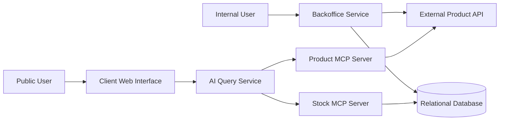

# Inventory Management System - Architecture Document

## 1. Overview

The system manages stock for a fictional retail company with multiple branches.

It contains two main user-facing applications:

- A Backoffice for authenticated internal users.
- A public Client Web Interface for natural-language product and stock questions.

The system is divided into independent services so that stock management, product access and AI queries remain separated.

## 2. High-Level Architecture

## 3. Services

### 3.1 Backoffice Service

The backoffice service is an authenticated internal web application.

Its responsibilities are:

Authenticating internal users.
Managing users and permissions.
Managing stock quantities.
Restricting common users to their assigned branch.
Allowing the administrator to manage common users.
Retrieving product information from the external Product API.
The Backoffice Service is the only user-facing service allowed to modify stock data.

The Backoffice Service is built with Flask and Jinja2 using Server-Side Rendering (SSR).

The service uses SQLAlchemy 2.0 with the psycopg 3 driver to communicate with the PostgreSQL database.

User authentication is based on Flask-Login, while passwords are securely stored using the Argon2id hashing algorithm provided by argon2-cffi.

### 3.2 Relational Database

The relational database is implemented using PostgreSQL 16.

Its responsibilities are:

- Storing user accounts and authentication information.
- Storing branch information.
- Storing stock quantities for each product and branch.
- Enforcing relationships between users, branches, and stock records.
- Ensuring stock quantities remain consistent and never become negative.

The database only stores the product identifier associated with each stock record. Product information is managed externally by the Product API.

A dedicated read-only database role (`mcp_reader`) is used by the Stock MCP Server to prevent AI services from modifying business data.

### 3.3 External Product API

The External Product API is a read-only service provided as a Docker container.

Its responsibilities are:

- Authenticating internal users.
- Managing users and permissions.
- Managing stock quantities.
- Restricting common users to their assigned branch.
- Allowing the administrator to manage common users.
- Retrieving product information from the External Product API.

The Product API does not manage stock quantities or users. 

All product information displayed by the system is retrieved from this service.

### 3.4 Product MCP Server

The Product MCP Server is implemented using FastMCP.

Its responsibilities are:

- Exposing tools for listing available products.
- Exposing tools for retrieving product details.
- Forwarding requests to the External Product API using HTTP.
- Returning structured product information to the AI Query Service.

The server uses the Streamable HTTP transport provided by the MCP protocol.

### 3.5 Stock MCP Server

The Stock MCP Server is implemented using FastMCP.

Its responsibilities are:

- Exposing read-only tools for querying stock quantities.
- Retrieving stock availability from the PostgreSQL database.
- Preventing direct database access from AI agents.

The server connects to the database using a dedicated read-only role (`mcp_reader`) to ensure that AI services cannot modify stock information.

### 3.6 AI Query Service

The AI Query Service is implemented using FastAPI and Uvicorn.

Its responsibilities are:

- Receiving user questions through the `/ask` endpoint.
- Processing natural-language requests using a single AI agent.
- Communicating with the Product MCP Server and the Stock MCP Server through the official MCP client.
- Combining information returned by MCP tools.
- Returning the final response to the Client Web Interface.

The AI agent relies on the Anthropic SDK and never communicates directly with the database or the Product API.

### 3.7 Client Web Interface

The Client Web Interface is a lightweight web application built with HTML, CSS and vanilla JavaScript.

Its responsibilities are:

- Providing a simple interface for anonymous users.
- Sending questions to the AI Query Service through REST requests.
- Displaying AI-generated responses.
- Showing loading and error messages.

The interface is served by Nginx.

## 4. Communication with services

### Backoffice Service

Communicates with the Relational Database through SQLAlchemy to manage users, branches, and stock quantities.

And

Communicates with the External Product API through REST requests to retrieve product information when displaying products.

### Client Web Interface

Sends user queries to the AI Query Service using a REST API.

### AI Query Service

Communicates with the Product MCP Server to retrieve product information.

And

Communicates with the Stock MCP Server to retrieve stock information.

### Product MCP Server

Communicates with the External Product API through REST requests.

### Stock MCP Server

Communicates with the Relational Database using SQLAlchemy to retrieve stock data.

This separation ensures that each service has a single responsibility and can evolve independently.

## 5. Local Data Storage

The locally stored data includes:

User accounts.
Password hashes.
User roles.
Branch information.
User-to-branch assignments.
Stock quantities.
Product identifiers associated with stock records.

The application does not store product names, descriptions, prices, images, or other product metadata.

## 6. External Product Data

All product information is provided by the External Product API.

This data includes:

Product names.
Product descriptions.
Product prices.
Product images.
Product categories.
Other product metadata.

The Product API acts as the single source of truth for all product-related information.
Whenever product details are required, the application retrieves them from this service instead of storing them locally.

## 7. AI Agent Data Access

The AI agent does not directly access the database or the External Product API.

Instead, it relies on MCP servers to retrieve the required information.

The AI agent accesses:

Product information through the Product MCP Server, which exposes tools for listing products and retrieving product details from the External Product API.
Stock information through the Stock MCP Server, which exposes tools for querying stock availability from the relational database.

By using MCP servers as intermediaries, the AI Query Service remains independent of the underlying data sources while ensuring secure and controlled access to both product and stock information.

## 8. Communication Strategies

### 8.1 Backoffice Communication

Selected Option

Server-Side Rendering (SSR) using Flask and Jinja2.

Main Benefit

Simple architecture, minimal JavaScript, and seamless integration with Flask, SQLAlchemy, and Flask-Login.

Trade-off

Less interactive than a Single Page Application.

### 8.2 Client Web Interface Communication

Selected Option

REST communication.

Main Benefit

Each user request is independent, making REST simple, reliable, and easy to debug.

Trade-off

REST does not support response streaming or real-time bidirectional communication.

### 8.3 AI Query Service Communication

Selected Option

Model Context Protocol (MCP) using FastMCP servers.

Main Benefit

Provides a standardized and secure way for AI agents to access external tools while keeping the architecture modular.

Trade-off

Adds additional services and slightly increases deployment complexity.

## 9. Minimum Viable Product (MVP)

### 9.1 Features to Implement First

- User authentication
- Branch management
- User management
- Stock management
- Product MCP Server
- Stock MCP Server
- AI Query Service
- Client Web Interface
- REST communication

### 9.2 Features to Implement Later

- Improved UI
- Better API error handling
- Logging
- Performance improvements
- Refactoring

### 9.3 Optional Features

- WebSocket communication
- AI response streaming
- Conversation history
- Inventory dashboard
- Advanced search

## 10. Security

### Password Storage

Passwords are hashed using the Argon2id algorithm through the argon2-cffi library. Plain-text passwords are never stored in the database.

### Authentication

The Backoffice uses Flask-Login to manage authenticated user sessions through secure cookies.

### Authorization

Role-based authorization is enforced on the server side.

- Administrators manage users.
- Common users can only manage stock for their assigned branch.

### Database Security

The Stock MCP Server accesses PostgreSQL using the dedicated `mcp_reader` role, which has read-only permissions. This prevents AI services from modifying business data.
