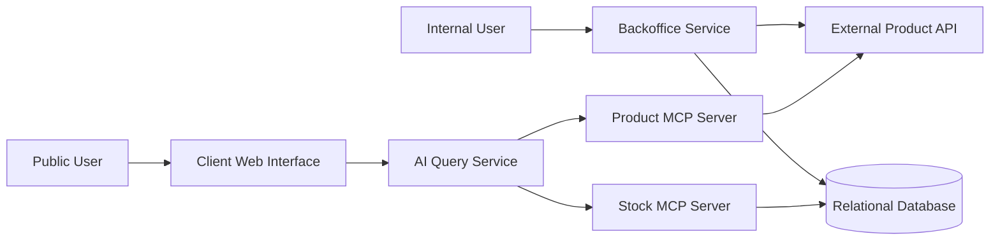

# Inventory Management System - Architecture Document

## 1. Overview

The system manages stock for a fictional retail company with multiple branches.

It contains two main user-facing applications:

- A Backoffice for authenticated internal users.
- A public Client Web Interface for natural-language product and stock questions.

The system is divided into independent services so that stock management, product access and AI queries remain separated.

## 2. High-Level Architecture

## 3. Services

### 3.1 Backoffice Service

The backoffice service is an authenticated internal web application.

Its responsibilities are:

Authenticating internal users.
Managing users and permissions.
Managing stock quantities.
Restricting common users to their assigned branch.
Allowing the administrator to manage common users.
Retrieving product information from the external Product API.
The Backoffice Service is the only user-facing service allowed to modify stock data.

The service uses SQLAlchemy to communicate with the relational database.

### 3.2 Relational Database

The relational database stores all local data required by the inventory management system.

Its responsibilities are:

Storing user accounts and authentication information.
Storing branch information.
Storing stock quantities for each product and branch.
Enforcing relationships between users, branches, and stock records.
Ensuring stock quantities remain consistent and never become negative.

The database does not store product names, descriptions, prices, images, or any other product metadata. 

It only stores product identifiers associated with stock records.

### 3.3 External Product API

The External Product API is a read-only service provided as a Docker container.

Its responsibilities are:

Providing the list of available products.
Returning detailed information about a specific product.
Acting as the single source of truth for product data.

The Product API does not manage stock quantities or users. 

All product information displayed by the system is retrieved from this service.

### 3.4 Product MCP Server

The Product MCP Server acts as a bridge between the AI Query Service and the External Product API.

Its responsibilities are:

Exposing tools for listing available products.
Exposing tools for retrieving product details.
Forwarding requests from AI agents to the Product API.
Returning structured product information to the AI Query Service.

The Product MCP Server abstracts the communication with the Product API, allowing AI agents to access product information through MCP tools instead of calling the API directly.

### 3.5 Stock MCP Server

The Stock MCP Server provides controlled access to stock information stored in the relational database.

Its responsibilities are:

Exposing tools for querying stock quantities.
Retrieving stock availability for a specific product.
Retrieving products available in a specific branch.
Providing stock information to AI agents.
Preventing direct database access from AI agents.

The Stock MCP Server acts as a secure interface between the AI Query Service and the relational database.

### 3.6 AI Query Service

The AI Query Service is an independent backend service responsible for processing natural-language queries from users.

Its responsibilities are:

Receiving questions from the Client Web Interface.
Interpreting user requests using one or more AI agents.
Retrieving product information through the Product MCP Server.
Retrieving stock information through the Stock MCP Server.
Combining information from multiple sources to generate accurate responses.
Informing users when the requested information is unavailable.

The AI Query Service does not directly communicate with the Product API or the database. 

Instead, it relies on MCP tools to access external information.

### 3.7 Client Web Interface

The Client Web Interface is the public entry point for anonymous users.

Its responsibilities are:

Providing a simple interface for asking inventory-related questions.
Sending user queries to the AI Query Service.
Displaying AI-generated responses.
Allowing users to search for product and stock information without authentication.

The Client Web Interface does not access the database or the Product API directly. 

All requests are handled through the AI Query Service.
