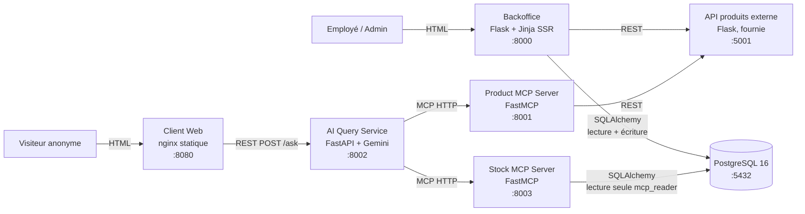
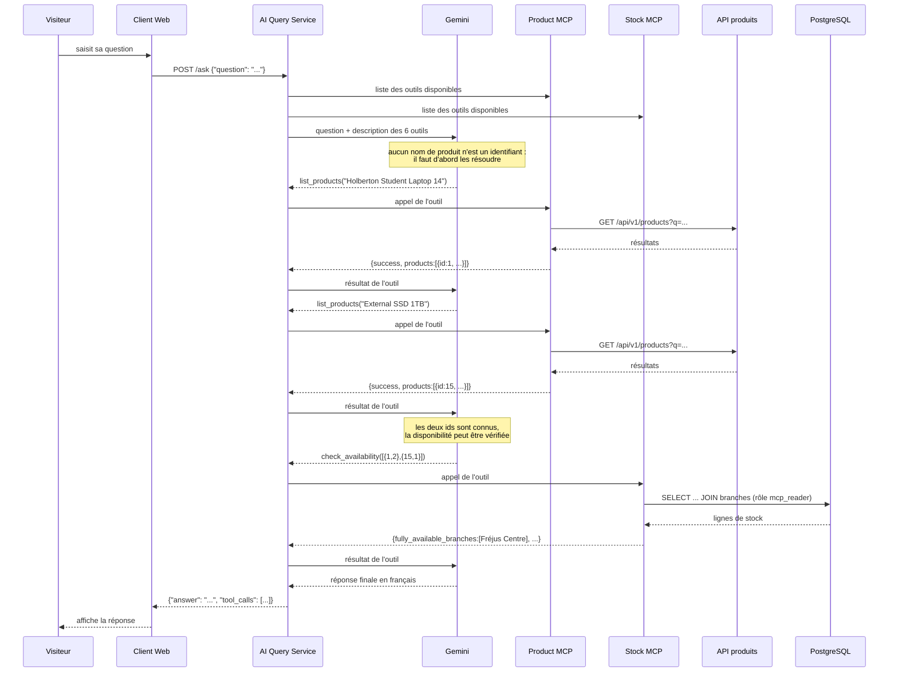

# Architecture - HBNtory

## Vue d'ensemble

HBNtory gère le stock d'une entreprise de vente au détail répartie sur
plusieurs succursales. Deux applications sont destinées aux utilisateurs :

- un **Backoffice** authentifié, pour les employés et l'administrateur ;
- un **Client Web** public, où des visiteurs anonymes posent des questions
  en langage naturel.

Le système est découpé en services indépendants pour que la gestion du
stock, l'accès aux produits et les requêtes IA restent séparés. Chaque
service a une responsabilité unique et peut évoluer sans casser les
autres.

## Diagramme des services

Deux chemins de données, volontairement disjoints :

- **Chemin d'écriture** - Employé -> Backoffice -> base. Authentifié, c'est
  le seul par lequel le stock peut être modifié.
- **Chemin de lecture IA** - Visiteur -> Client Web -> AI Service -> MCP ->
  base / API. Anonyme, et **en lecture seule de bout en bout**.

Aucun outil MCP n'expose d'écriture, et le Stock MCP Server se connecte à
PostgreSQL avec un rôle qui ne détient que le privilège `SELECT`. Un
visiteur anonyme ne peut donc pas modifier le stock, même en formulant sa
question de façon malveillante.

## Les services

### Backoffice

Application web interne, authentifiée, rendue côté serveur.

Responsabilités :

- authentifier les utilisateurs internes ;
- gérer les comptes et les rôles ;
- gérer les quantités de stock ;
- restreindre chaque employé à sa succursale ;
- permettre à l'administrateur de gérer les employés ;
- récupérer les informations produit depuis l'API externe.

C'est le **seul service autorisé à modifier le stock**. Il dialogue avec
PostgreSQL via SQLAlchemy et avec l'API produits en REST.

### PostgreSQL

Stocke uniquement les données locales : comptes et hashs de mots de passe,
rôles, succursales, rattachement des employés, quantités de stock et
identifiants produit associés.

Il ne stocke **ni nom, ni description, ni prix, ni image, ni catégorie**
de produit. Seul l'identifiant du produit est conservé. La base garantit
aussi la cohérence : contraintes d'unicité, quantités jamais négatives,
cohérence rôle/succursale. Détail dans [`database.md`](database.md).

### API produits externe

Service en lecture seule fourni par Holberton, dans
`external/product-api/`. **Ce dossier n'est pas modifié.**

Il fournit la liste des produits et le détail d'un produit, et constitue
la **source unique de vérité** des données produit. Il ne gère ni stock ni
utilisateurs.

Il sait aussi simuler des pannes (`force_error=true`) et de la latence
(`simulate_delay_ms`), ce qui a servi à tester notre gestion d'erreurs.

### Product MCP Server

Pont entre l'agent IA et l'API produits. Il expose deux outils :

| Outil | Rôle |
|---|---|
| `list_products(query, limit)` | Recherche par texte libre, ou catalogue complet |
| `get_product_details(product_id)` | Détail d'un produit dont l'id est connu |

Il traduit les réponses de l'API en structures stables
`{success, ..., error}` et n'expose jamais d'exception brute au protocole
MCP.

### Stock MCP Server

Accès contrôlé au stock stocké en base. Quatre outils, **tous en lecture
seule** :

| Outil | Rôle |
|---|---|
| `list_branches()` | Résoudre un nom ou une ville en `branch_id` |
| `get_stock_by_product(product_id)` | Quelles succursales ont ce produit, en quelle quantité |
| `get_stock_by_branch(branch_id)` | Que contient une succursale |
| `check_availability(items)` | Quelle succursale peut satisfaire une liste d'achats |

Il se connecte avec le rôle PostgreSQL `mcp_reader`, qui n'a que `SELECT`
sur `branches` et `stock`, et **aucun accès à `users`**. Son modèle
SQLAlchemy ne déclare même pas la table `users`.

### AI Query Service

Service backend indépendant qui traite les questions en langage naturel.

Responsabilités :

- recevoir les questions du Client Web (`POST /ask`) ;
- laisser l'agent Gemini choisir et enchaîner les outils MCP ;
- combiner produits et stock pour construire une réponse ;
- dire clairement quand l'information n'est pas disponible.

Il n'accède **ni** à la base **ni** à l'API produits directement : il ne
connaît que des outils MCP. La boucle d'orchestration est limitée à
`MAX_TOOL_ITERATIONS = 6` pour qu'une question mal posée ne puisse pas
faire tourner l'agent indéfiniment.

Le prompt système impose trois règles : répondre uniquement à partir des
données renvoyées par les outils, ne jamais inventer un nom, un prix ou
une quantité, et signaler explicitement un `success=false` ou une liste
vide.

### Client Web

Page publique statique servie par nginx : un champ de question, un
indicateur d'attente, une zone de réponse. Aucune authentification.

Elle n'accède ni à la base ni à l'API produits : tout passe par l'AI
Query Service.

## Communication entre services

| De | Vers | Protocole | Pourquoi |
|---|---|---|---|
| Navigateur | Backoffice | HTML (SSR) | Interface CRUD interne, quasi sans JavaScript |
| Backoffice | PostgreSQL | SQLAlchemy | Lecture et écriture des données locales |
| Backoffice | API produits | REST | Enrichir l'affichage, vérifier un `product_id` |
| Client Web | AI Service | REST `POST /ask` | Une question, une réponse, sans état |
| AI Service | MCP servers | MCP sur HTTP | Outils standardisés, sources interchangeables |
| Product MCP | API produits | REST | Seule interface offerte par le fournisseur |
| Stock MCP | PostgreSQL | SQLAlchemy (`mcp_reader`) | Lecture seule, privilèges minimaux |

Dans Docker Compose, les services s'adressent par **nom de service** et
**port interne** (`http://external-products-api:5000`), jamais par
`localhost` - qui, dans un conteneur, désigne le conteneur lui-même.

## Comment l'agent utilise les outils MCP

Le diagramme suit une question de liste d'achats :

> Je veux 2 Holberton Student Laptop 14 et 1 External SSD 1TB, dans
> quelle succursale aller ?

Sur les données de `seed.py`, Fréjus Centre est la seule succursale à
détenir les deux (5 laptops, 3 SSD) ; Laval Gare a les laptops mais 0 SSD
et n'apparaît donc pas dans `fully_available_branches`.

> L'**enchaînement d'outils** ci-dessous est celui réellement observé,
> capturé au scénario 4 de [`testing.md`](testing.md). Les **arguments**,
> eux, ont été remplacés : la capture d'origine portait sur l'*Inventory
> Tablet 10* (produit 38), dont la réponse ne se reproduit pas sur une base
> fraîche. Le produit 15 donne le même parcours d'appels avec un résultat
> vérifiable par n'importe qui.

Points à retenir :

- **L'agent ne décide pas seul de la vérité.** Chaque affirmation de la
  réponse finale provient d'un résultat d'outil. Le prompt système interdit
  d'inventer un nom, un prix ou une quantité.
- **La boucle est bornée** à `MAX_TOOL_ITERATIONS = 6`. Une question mal
  posée ne peut pas faire tourner l'agent indéfiniment.
- **Deux serveurs MCP dans une seule réponse.** C'est ce qui justifie
  l'architecture : produits et stock vivent dans deux sources différentes,
  et l'agent les combine sans savoir que l'une est une API REST et l'autre
  une base PostgreSQL.
- **La trace est renvoyée** dans `tool_calls`, ce qui permet de vérifier
  après coup qu'une réponse s'appuie sur de vraies données.
- **Rien de tout cela ne peut écrire.** Aucun des six outils n'expose de
  mutation, et le Stock MCP interroge la base avec un rôle restreint à
  `SELECT`.

## Frontière des données

| Stocké localement (PostgreSQL) | Fourni par l'API externe |
|---|---|
| Comptes, hashs de mots de passe, rôles | `name`, `description`, `category`, `brand` |
| Succursales, rattachement des employés | `sku`, `unit_price`, `currency` |
| Quantités de stock | `discontinued`, `tags`, `weight_kg`, images |
| `product_id` (référence seule) | Métadonnées fournisseur |

Cette séparation évite toute duplication à resynchroniser : un prix
modifié côté fournisseur est visible immédiatement. En contrepartie,
l'intégrité référentielle devient applicative (`product_exists()`) et
l'affichage doit tolérer une panne de l'API - ce qu'il fait, en montrant
les quantités sans les noms plutôt qu'une erreur.

## Stratégies de communication

### Backoffice : rendu côté serveur (SSR)

**Choix** - Flask + templates Jinja.

**Bénéfice** - Les pages HTML sont générées sur le serveur. Presque aucun
JavaScript, intégration naturelle avec Flask et SQLAlchemy, et Flask-WTF
fournit la protection CSRF sans effort. Largement suffisant pour des
écrans CRUD internes.

**Compromis** - Interface moins interactive qu'une application
client-side : chaque action recharge la page. Acceptable pour un outil
interne où la fiabilité compte plus que la fluidité.

**Alternative écartée** - Une SPA (React/Vue) sur une API REST aurait
imposé de gérer l'authentification par jeton, le CORS et un build
front-end, pour une valeur nulle sur des formulaires de gestion.

### Client Web <-> AI Service : REST

**Choix** - `POST /ask`, qui reçoit `{"question": str}` et retourne
`{"answer": str, "tool_calls": list}`.

**Bénéfice** - Chaque question est indépendante : il n'y a aucun
historique de conversation à maintenir. REST est simple à implémenter, à
tester (`curl`) et à déboguer. Le champ `tool_calls` expose la trace des
outils appelés, ce qui permet de vérifier que la réponse s'appuie sur de
vraies données.

**Compromis** - Pas de streaming : l'utilisateur attend la réponse
complète (1,4 à 4 s en pratique). Pas de communication bidirectionnelle.

**Alternative écartée** - WebSocket ne se justifierait que pour du
streaming token par token ou une session de chat avec mémoire, ni l'un ni
l'autre n'étant requis.

### AI Service <-> données : MCP

**Choix** - Le Model Context Protocol, sur transport HTTP.

**Bénéfice** - L'agent ne connaît ni SQL, ni l'URL de l'API produits, ni
le schéma de la base : il ne voit que des outils décrits par un schéma
JSON. Les sources peuvent changer sans toucher à l'agent, et le périmètre
d'accès est défini par la liste des outils exposés - donc contrôlable.

**Compromis** - Une couche de plus à déployer et à surveiller : deux
services supplémentaires, et une latence d'appel à chaque outil. En
échange, la modularité et le cloisonnement sont réels.

## Pourquoi un Stock MCP Server sur mesure

L'accès de l'agent au stock pouvait se faire de trois façons. Le choix
mérite d'être justifié, car un serveur MCP de base de données générique
aurait demandé moins de code.

| Option | Description | Écartée / retenue |
|---|---|---|
| **A. Serveur MCP de base de données générique** | Un serveur MCP prêt à l'emploi exposant un outil `query(sql)` sur PostgreSQL. | **Écartée** |
| **B. API REST interne** | Exposer des endpoints REST sur le Backoffice, appelés par l'AI Service. | **Écartée** |
| **C. Serveur MCP sur mesure** | Quatre outils métier, en lecture seule, sur un rôle PostgreSQL restreint. | **Retenue** |

**Pourquoi pas A (MCP base de données générique).** Un outil `query(sql)`
donne au modèle la capacité d'écrire du SQL arbitraire. Trois problèmes :

1. **Surface d'attaque.** Une injection de prompt réussie pourrait tenter
   `SELECT password_hash FROM users`. Le rôle `mcp_reader` bloquerait la
   requête, mais faire reposer la sécurité sur cette seule barrière est
   fragile - et sans elle, la fuite serait immédiate.
2. **Fiabilité.** Le modèle devrait connaître le schéma et écrire du SQL
   correct à chaque question. Une jointure oubliée entre `stock` et
   `branches` produit une réponse fausse *mais plausible* - le pire cas
   pour un utilisateur.
3. **Couplage.** Renommer une colonne casserait l'agent, puisque le SQL
   est produit par le modèle et non par notre code.

**Pourquoi pas B (API REST interne).** Techniquement viable, mais elle
recrée à la main ce que MCP standardise : description des paramètres,
découverte des capacités, format des erreurs. Il faudrait décrire chaque
endpoint dans le prompt, et le maintenir en cohérence à chaque
modification. Cela aurait aussi élargi le rôle du Backoffice, qui aurait
alors servi à la fois les écrans internes et une API publique - au prix de
la séparation des responsabilités. La consigne demande par ailleurs
explicitement l'usage de MCP.

**Pourquoi C.** Les quatre outils encapsulent des **questions métier**,
pas des requêtes :

- le SQL est écrit par nous, testé, avec les jointures et les filtres
  corrects (`Branch.is_active`) - le modèle ne peut pas les oublier ;
- la surface d'attaque est réduite à quatre signatures typées : il n'y a
  aucun moyen d'exprimer une lecture de `users`, même en le demandant ;
- `check_availability` fait en un appel ce qui aurait exigé plusieurs
  requêtes et un raisonnement d'agrégation côté modèle - donc moins
  d'allers-retours et moins d'occasions de se tromper ;
- les descriptions d'outils indiquent quand utiliser l'un plutôt que
  l'autre, ce qui guide le choix du modèle ;
- le rôle `mcp_reader` devient une **seconde** barrière, pas la seule.

Le coût est un peu plus de code à écrire et à maintenir. Pour un accès
ouvert à des visiteurs anonymes, c'est le bon échange.

## MVP - ordre de réalisation

Le MVP est la plus petite version fonctionnelle qui satisfait toutes les
exigences obligatoires. L'ordre suit les dépendances techniques : rien ne
peut être testé sans la couche qui le précède.

### Réalisé en premier (socle indispensable)

1. **Schéma et modèles SQLAlchemy** - `branches`, `users`, `stock`, avec
   les contraintes. Tout le reste en dépend.
2. **Script d'initialisation et données de démonstration** - sans données,
   rien n'est vérifiable.
3. **Authentification** - hachage Argon2, connexion, rejet des comptes
   supprimés, sessions. Aucune fonctionnalité du Backoffice n'existe sans
   utilisateur connecté.
4. **Autorisation par rôle** - décorateurs `admin_required` et
   `common_user_required`, isolation par succursale.
5. **Opérations de stock et validation** - ajout, retrait, listage, avec
   les règles métier dans la couche service.
6. **Gestion des utilisateurs par l'administrateur** - création, soft
   delete, (dés)activation, changement de mot de passe et de succursale.
7. **Intégration de l'API produits externe** - enrichissement de
   l'affichage et vérification des `product_id`.

À ce stade, le Backoffice est complet et testable seul.

### Réalisé ensuite (chaîne IA)

8. **Product MCP Server** - le plus simple des deux : il ne fait que
   traduire des appels REST, sans état.
9. **Stock MCP Server** - nécessite le rôle `mcp_reader`, donc la base et
   `init_db.py`.
10. **AI Query Service** - ne peut être testé qu'avec au moins un serveur
    MCP fonctionnel.
11. **Client Web** - dernière couche, la plus fine : elle ne fait
    qu'afficher ce que l'AI Service renvoie.

### Reporté après le périmètre obligatoire

- Suite de tests automatisée et intégration continue.
- Docker Compose pour l'ensemble des services et script `run-dev.sh`.
- Soin de l'interface : KPIs, modales, filtres, responsive.
- Activation/désactivation des comptes (distincte du soft delete).
- Protection contre l'énumération de comptes par mesure du temps.

Ces éléments ont finalement été livrés, mais ils ne conditionnaient pas la
validation du périmètre obligatoire - d'où leur position dans l'ordre.

### Tenté seulement si le temps le permettait

Ces pistes ont été identifiées et **non retenues**, faute de temps :

| Piste | Pourquoi écartée |
|---|---|
| Historique des mouvements de stock | Demande une table supplémentaire et une écriture à chaque opération. Utile, mais hors périmètre obligatoire. |
| Journal d'audit | Même raison : valeur réelle, coût non négligeable. |
| Mémoire conversationnelle du client | Impliquerait de gérer un état de session côté AI Service, alors que REST sans état était le choix assumé. |
| Réponses en streaming (WebSocket) | Contredirait le choix REST, pour un gain purement cosmétique. |
| Rôle SuperAdmin | Deux rôles suffisent aux règles demandées. |
| Limitation de débit sur `/ask` | Reconnu comme une limite (voir README), non traité. |
| Déploiement cloud | Sans valeur pour l'évaluation, qui se fait en local. |

Le principe retenu : **un système simple, complet et bien intégré vaut
mieux qu'un système ambitieux et inachevé.**

## Documents liés

| Document | Contenu |
|---|---|
| [`database.md`](database.md) | Schéma, ERD, dictionnaire des champs, initialisation |
| [`security.md`](security.md) | Authentification, hachage, autorisation |
| [`validation.md`](validation.md) | Règles de validation du stock |
| [`testing.md`](testing.md) | Preuves de tests |
| [`docker_build.md`](docker_build.md) | Guide Docker et dépannage |
| [`presentation.md`](presentation.md) | Plan de présentation et démonstration |
