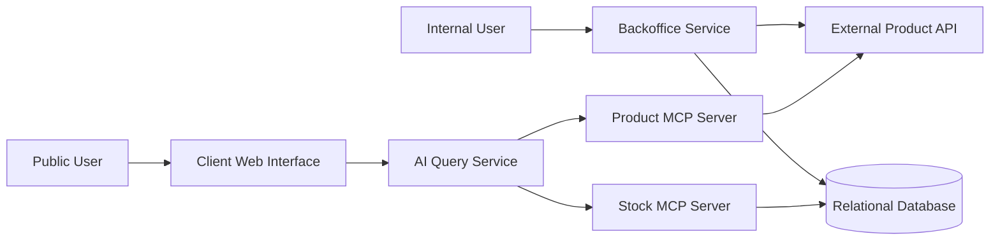

# Inventory Management System - Architecture Document

## 1. Overview

The system manages stock for a fictional retail company with multiple branches.

It contains two main user-facing applications:

- A Backoffice for authenticated internal users.
- A public Client Web Interface for natural-language product and stock questions.

The system is divided into independent services so that stock management, product access and AI queries remain separated.

## 2. High-Level Architecture

## 3. Services

### 3.1 Backoffice Service

The backoffice service is an authenticated internal web application.

Its responsibilities are:

- Authenticating internal users.
- Managing users and permissions.
- Managing stock quantities.
- Restricting common users to their assigned branch.
- Allowing the administrator to manage common users.
- Retrieving product information from the external Product API.

The Backoffice Service is the only user-facing service allowed to modify stock data.

The service uses SQLAlchemy to communicate with the relational database.

### 3.2 Relational Database

### 3.3 External Product API

### 3.4 Product MCP Server

### 3.5 Stock MCP Server

### 3.6 AI Query Service

### 3.7 Client Web Interface
