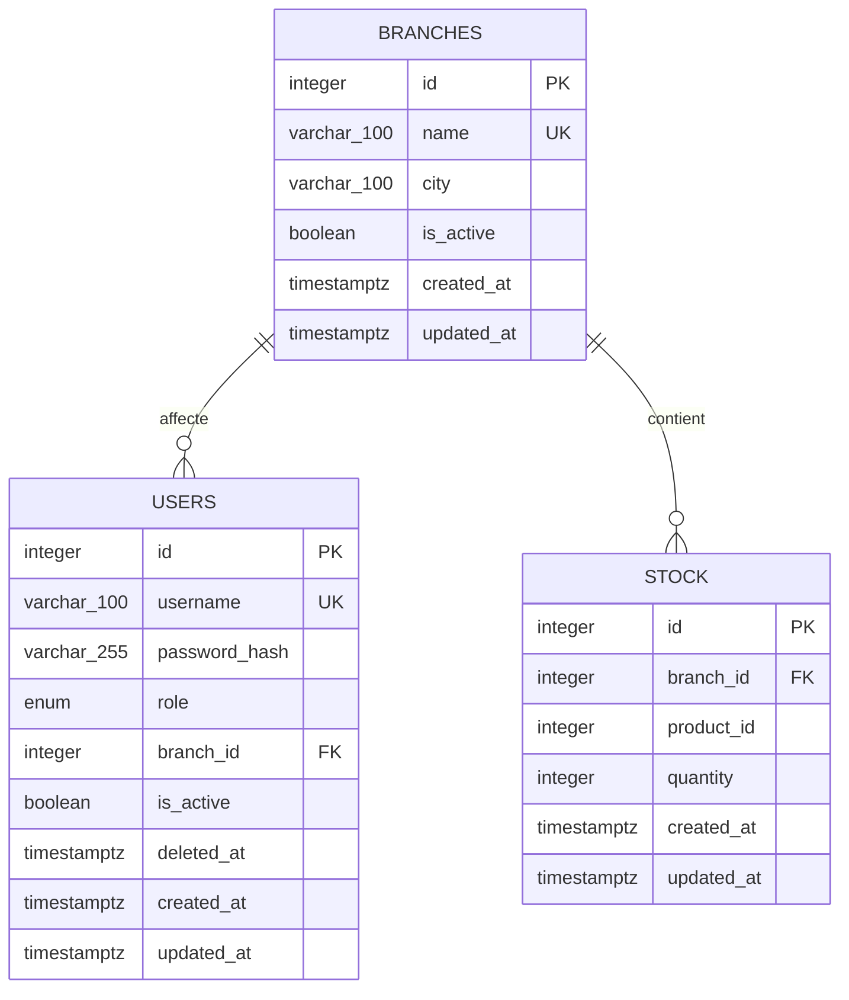

# Schéma de base de données

## Objectif

La base relationnelle conserve uniquement les données locales nécessaires au
Backoffice et aux requêtes de stock :

- comptes utilisateurs ;
- succursales ;
- identifiants externes des produits et quantités par succursale.

Elle ne contient aucun nom, description, prix, image, catégorie, SKU ou autre
métadonnée produit. Ces informations restent dans l'API produits externe.

## Diagramme relationnel



## Table `branches`

| Colonne | Type | Null | Règle |
| --- | --- | --- | --- |
| `id` | entier | non | clé primaire |
| `name` | chaîne, 100 caractères | non | nom unique |
| `city` | chaîne, 100 caractères | non | ville affichée et recherchable |
| `is_active` | booléen | non | succursale visible par les outils publics |
| `created_at` | date/heure avec fuseau | non | valeur serveur à la création |
| `updated_at` | date/heure avec fuseau | non | mise à jour lors d'une modification |

Une succursale peut avoir plusieurs utilisateurs communs et plusieurs lignes de
stock.

## Table `users`

| Colonne | Type | Null | Règle |
| --- | --- | --- | --- |
| `id` | entier | non | clé primaire |
| `username` | chaîne, 100 caractères | non | identifiant unique |
| `password_hash` | chaîne, 255 caractères | non | hash Argon2, jamais le mot de passe |
| `role` | enum `ADMIN` ou `COMMON` | non | rôle utilisé par l'autorisation |
| `branch_id` | entier | selon le rôle | clé étrangère vers `branches.id` |
| `is_active` | booléen | non | permet de suspendre un compte |
| `deleted_at` | date/heure avec fuseau | oui | marque le soft-delete |
| `created_at` | date/heure avec fuseau | non | date de création |
| `updated_at` | date/heure avec fuseau | non | date de dernière modification |

La contrainte `ck_users_role_branch_consistency` impose :

```text
COMMON  -> branch_id obligatoire
ADMIN   -> branch_id obligatoirement NULL
```

Ainsi, un utilisateur commun appartient à exactement une succursale et
l'administrateur n'a aucune succursale sur laquelle opérer.

La suppression est logique : `deleted_at` est renseigné, mais la ligne n'est
pas effacée. Comme le stock dépend d'une succursale et non d'un utilisateur,
supprimer un utilisateur ne supprime aucun stock.

## Table `stock`

| Colonne | Type | Null | Règle |
| --- | --- | --- | --- |
| `id` | entier | non | clé primaire |
| `branch_id` | entier | non | clé étrangère vers `branches.id` |
| `product_id` | entier | non | identifiant fourni par l'API externe |
| `quantity` | entier | non | valeur comprise entre 0 et 1 000 000 |
| `created_at` | date/heure avec fuseau | non | date de création |
| `updated_at` | date/heure avec fuseau | non | date de dernière modification |

Contraintes et index :

- `uq_stock_branch_product` garantit une seule ligne par couple
  `(branch_id, product_id)` ;
- `ck_stock_quantity_non_negative` interdit une quantité négative ;
- `ck_stock_quantity_maximum` limite une ligne à 1 000 000 unités ;
- `ix_stock_product_id` accélère la recherche du stock d'un produit dans
  plusieurs succursales.

`product_id` n'est pas une clé étrangère locale : la table produits appartient
à un service externe. Lorsqu'une nouvelle ligne de stock est créée, le service
Backoffice vérifie l'identifiant auprès de l'API produits.

## Intégrité et suppressions

Les clés étrangères utilisent `ON DELETE RESTRICT`. Une succursale référencée
par un utilisateur ou du stock ne peut donc pas être supprimée accidentellement.

Les règles critiques existent à deux niveaux :

- la base protège l'état final avec des contraintes ;
- la couche de services protège l'intention de l'opération, le rôle de
  l'utilisateur et l'existence externe du produit.

Cette répartition est détaillée dans
[`validation.md`](validation.md).

## Initialisation

Le script `backoffice/bootstrap.py` exécute dans l'ordre :

1. `Base.metadata.create_all()` pour créer les tables absentes ;
2. la création ou la mise à jour du rôle PostgreSQL `mcp_reader` ;
3. la seed idempotente.

La seed complète uniquement les succursales, comptes et lignes de stock
manquants. Elle ne modifie ni les mots de passe, ni les quantités existantes.
Le mode `seed.py --reset` est la seule procédure destructive prévue pour les
données de démonstration.

## Accès du Stock MCP

Le Stock MCP n'emploie pas le compte complet du Backoffice. Il se connecte avec
`MCP_DATABASE_URL`, dont le rôle PostgreSQL :

- peut faire `SELECT` sur `branches` et `stock` ;
- ne peut pas accéder à `users` ;
- ne peut effectuer aucune écriture.

L'accès anonyme depuis le client web ne peut donc pas être transformé en
modification de stock ou en lecture de comptes, même en cas d'erreur dans
l'agent IA.
