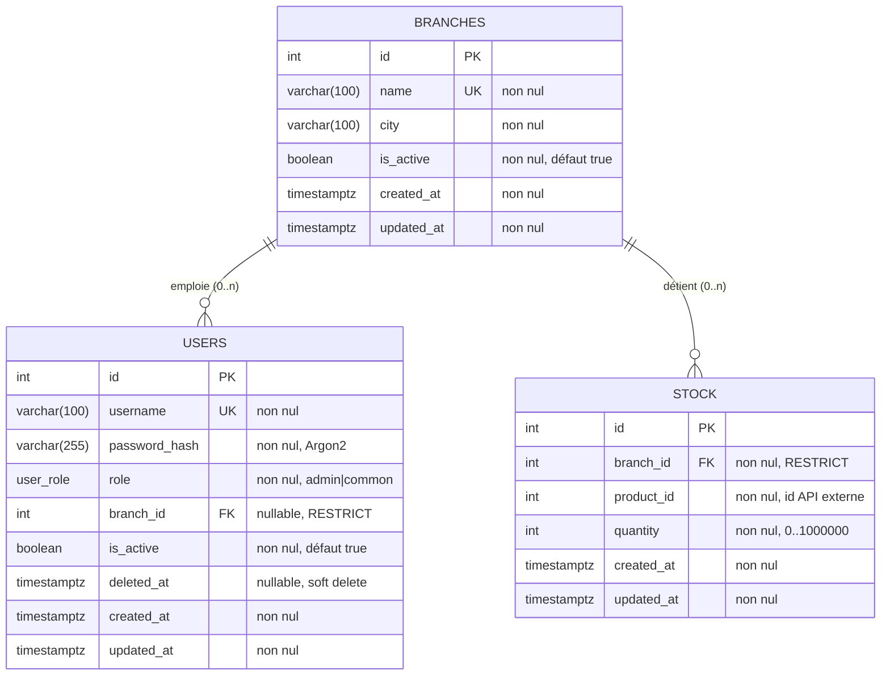

# Schéma de la base de données

La base locale (PostgreSQL 16) contient **trois tables** : `branches`,
`users` et `stock`. Elle ne stocke **aucune donnée produit** - ni nom, ni
prix, ni description, ni image. Seul l'identifiant du produit est
conservé, dans `stock.product_id`.

Implémentation : [`backoffice/models.py`](../backoffice/models.py).

## Diagramme relationnel



**Cardinalités**

- Une succursale emploie **0 à n** utilisateurs ; un employé appartient à
  **exactement une** succursale, l'administrateur à **aucune**.
- Une succursale détient **0 à n** lignes de stock ; une ligne de stock
  appartient à **exactement une** succursale.
- Il n'y a **pas** de relation directe entre `users` et `stock` : le lien
  passe toujours par la succursale.

## Table `branches`

Une succursale physique de l'entreprise.

| Colonne | Type | Contraintes | Description |
|---|---|---|---|
| `id` | `integer` | **PK**, auto | Identifiant interne. |
| `name` | `varchar(100)` | non nul, **unique** | Nom complet, ex. `Fréjus Centre`. Unique : deux succursales homonymes seraient indiscernables pour l'agent IA. |
| `city` | `varchar(100)` | non nul | Ville, ex. `Fréjus`. Séparée du nom pour permettre une recherche par ville. |
| `is_active` | `boolean` | non nul, défaut `true` | Une succursale fermée est désactivée, jamais supprimée : ses lignes de stock et son historique restent lisibles. Les outils MCP filtrent sur `is_active = true`. |
| `created_at` | `timestamptz` | non nul, défaut `now()` | Date de création. |
| `updated_at` | `timestamptz` | non nul, auto | Mise à jour automatique à chaque `UPDATE`. |

## Table `users`

Un employé de l'entreprise, ou l'administrateur.

| Colonne | Type | Contraintes | Description |
|---|---|---|---|
| `id` | `integer` | **PK**, auto | Identifiant interne. Stocké dans le cookie de session. |
| `username` | `varchar(100)` | non nul, **unique** | Identifiant de connexion. |
| `password_hash` | `varchar(255)` | non nul | Hash Argon2id. **Jamais** le mot de passe en clair. 255 caractères : un hash Argon2 encodé fait ~95 caractères, la marge couvre un changement de paramètres. |
| `role` | `user_role` (enum) | non nul, défaut `common` | `admin` ou `common`. Type énuméré PostgreSQL : la base refuse toute autre valeur. |
| `branch_id` | `integer` | **FK** -> `branches.id`, `ON DELETE RESTRICT`, indexé, **nullable** | Succursale de rattachement. `NULL` pour l'administrateur, qui ne gère aucun stock. |
| `is_active` | `boolean` | non nul, défaut `true` | Compte suspendu mais réactivable. La connexion est refusée. |
| `deleted_at` | `timestamptz` | nullable | **Soft delete**. `NULL` = compte vivant. Une date = compte supprimé, connexion refusée définitivement. |
| `created_at` | `timestamptz` | non nul, défaut `now()` | Date de création. |
| `updated_at` | `timestamptz` | non nul, auto | Mise à jour automatique. |

### Contrainte de cohérence rôle / succursale

```sql
CONSTRAINT ck_users_role_branch_consistency CHECK (
    (role = 'COMMON' AND branch_id IS NOT NULL)
 OR (role = 'ADMIN'  AND branch_id IS NULL)
)
```

Cette contrainte traduit deux règles de la consigne directement dans le
schéma :

1. un employé appartient à **exactement une** succursale - pas zéro ;
2. l'administrateur **n'a pas** de responsabilité sur le stock - il n'a
   donc pas de succursale.

L'intérêt est qu'aucun code ne peut la contourner. Un employé sans
succursale, ou un admin rattaché à une succursale, est un état
**impossible à écrire**, pas seulement un état que l'application évite.
C'est ce qui rend fiable le `_user_branch_id()` de la couche service : il
lève `NoBranchAssigned` pour l'admin, et cette branche du code ne peut pas
être atteinte par un employé.

## Table `stock`

La quantité d'un produit externe dans une succursale.

| Colonne | Type | Contraintes | Description |
|---|---|---|---|
| `id` | `integer` | **PK**, auto | Identifiant de la ligne. |
| `branch_id` | `integer` | **FK** -> `branches.id`, `ON DELETE RESTRICT`, non nul | Succursale détenant ce stock. |
| `product_id` | `integer` | non nul, indexé | Identifiant du produit **dans l'API externe** (champ `id`, pas le `sku`). **Aucune clé étrangère** : la table référencée n'existe pas dans notre base. |
| `quantity` | `integer` | non nul, défaut `0`, `0 ≤ quantity ≤ 1 000 000` | Nombre d'unités disponibles. |
| `created_at` | `timestamptz` | non nul, défaut `now()` | Première mise en stock. |
| `updated_at` | `timestamptz` | non nul, auto | Dernier mouvement. |

### Contraintes

```sql
CONSTRAINT uq_stock_branch_product UNIQUE (branch_id, product_id)
CONSTRAINT ck_stock_quantity_non_negative CHECK (quantity >= 0)
CONSTRAINT ck_stock_quantity_maximum     CHECK (quantity <= 1000000)
INDEX ix_stock_product_id ON stock (product_id)
```

- **`uq_stock_branch_product`** - une seule ligne par couple
  (succursale, produit). Sans elle, la même référence pourrait exister en
  double dans la même succursale et la quantité réelle deviendrait
  ambiguë. C'est cette contrainte qui autorise le code à faire
  « cherche la ligne, sinon crée-la ».
- **`ck_stock_quantity_non_negative`** - la garantie finale que le stock
  n'est jamais négatif, quel que soit le code qui écrit.
- **`ck_stock_quantity_maximum`** - plafond à 1 000 000 unités
  (`MAX_STOCK_QUANTITY`). Empêche une faute de frappe d'insérer une
  quantité absurde et de faire déborder l'`integer`.
- **`ix_stock_product_id`** - index sur `product_id` : la question
  « quelle succursale a le produit X ? », posée par l'agent IA, filtre sur
  cette colonne.

> Les contraintes de base protègent l'**état stocké**. Elles ne suffisent
> pas : un retrait de quantité `-5` produit un résultat positif et passe
> le `CHECK` tout en transformant un retrait en ajout caché. C'est la
> couche service qui protège l'**intention** de l'opération - voir
> [`validation.md`](validation.md).

## Frontière avec les données produit

`stock.product_id` est une clé étrangère **logique** vers l'API produits
externe. Elle n'existe pas au niveau du schéma, parce que PostgreSQL ne
peut pas référencer une table qui n'est pas dans la base.

| Dans notre base | Dans l'API externe |
|---|---|
| `product_id` | `id`, `sku`, `name`, `description`, `category`, `brand`, `unit_price`, `currency`, `discontinued`, images, fournisseur… |

Trois conséquences :

1. **Aucune synchronisation à maintenir.** Un prix qui change côté
   fournisseur est visible immédiatement, sans job de mise à jour.
2. **L'intégrité référentielle devient applicative.** `product_exists()`
   interroge `/api/v1/products/{id}` avant de créer une ligne de stock -
   c'est le substitut de la clé étrangère absente.
3. **L'affichage tolère la panne.** Si l'API produits est injoignable, le
   Backoffice affiche quand même les quantités, avec les noms et prix
   manquants et un avertissement, plutôt qu'une erreur 500.

L'identifiant utilisé est toujours l'`id` **numérique**, jamais le `sku`.
L'API accepte les deux sur sa route de détail, mais un seul type de clé
dans notre base évite toute ambiguïté - et le prompt de l'agent IA
interdit explicitement d'utiliser le `sku` pour appeler les outils.

## Stratégie de suppression

Trois états distincts pour un compte, volontairement séparés :

| État | Colonnes | Connexion | Réversible |
|---|---|---|---|
| Actif | `deleted_at IS NULL`, `is_active = true` | autorisée | - |
| Désactivé | `deleted_at IS NULL`, `is_active = false` | refusée | oui, par l'admin |
| Supprimé (soft delete) | `deleted_at` renseignée | refusée | non, via l'interface |

Aucune ligne n'est jamais physiquement supprimée. Un `DELETE` sur un
utilisateur casserait la traçabilité, et les clés étrangères en
`ON DELETE RESTRICT` refuseraient de supprimer une succursale encore
référencée par du stock ou des employés.

Le soft delete est appliqué à deux endroits :

- **à l'écriture** - `soft_delete_user()` renseigne `deleted_at` et refuse
  l'administrateur ;
- **à chaque requête** - le `user_loader` de Flask-Login recharge
  l'utilisateur en filtrant sur `deleted_at IS NULL` et
  `is_active IS TRUE`. Un compte supprimé ou désactivé pendant qu'il est
  connecté perd donc l'accès **à la requête suivante**, sans attendre
  l'expiration du cookie.

## Initialisation

Trois scripts, trois responsabilités :

| Script | Rôle | Relançable |
|---|---|---|
| [`init_db.py`](../backoffice/init_db.py) | Crée les tables manquantes, ajoute la contrainte de plafond aux bases antérieures, crée/met à jour le rôle `mcp_reader`. | oui, sans effet de bord |
| [`seed.py`](../backoffice/seed.py) | Insère les données de démonstration. **Écrase** les données existantes. | oui, destructif |
| [`bootstrap.py`](../backoffice/bootstrap.py) | Lance `init_db.py`, puis `seed.py` **uniquement si la base ne contient aucun utilisateur**. | oui, non destructif |

C'est `bootstrap.py` qui est exécuté automatiquement au démarrage du
conteneur, via `docker-entrypoint.sh`. Le choix de conditionner le seed à
l'absence d'utilisateur rend le démarrage idempotent : un
`docker compose up` sur une base déjà remplie ne détruit rien.

Aucun mot de passe en clair n'est écrit en base : `seed.py` hache
`ADMIN_PASSWORD` et `SEED_USER_PASSWORD` avec Argon2 avant l'insertion, et
prévient si le mot de passe admin par défaut est utilisé.

### Données de démonstration

- **3 succursales** : Fréjus Centre, Laval Gare, Toulouse Capitole
  (villes phonétiquement distinctes, pour tester la reconnaissance des
  noms par l'agent IA).
- **3 comptes** : `admin`, `marie` (Fréjus), `paul` (Laval).
- **36 lignes de stock**, conçues pour couvrir les cas limites :

| Cas couvert | Données |
|---|---|
| Un produit dans plusieurs succursales | produits 1, 3, 7, 9, 15, 21 |
| Aucune succursale n'a tout | 1, 3 et 15 ne sont jamais réunis -> l'agent doit proposer plusieurs succursales |
| Produit dans une seule succursale | produit 38 (Toulouse) |
| Produit `discontinued` côté API | produit 32 : on en détient du stock alors que `/products` l'exclut par défaut |
| Quantité à zéro | produit 4 à Fréjus, produit 15 à Laval -> vérifie les filtres |
| Produit nulle part | la majorité du catalogue -> « indisponible » reste une réponse possible |

## Sécurité d'accès à la base

Deux comptes PostgreSQL distincts, avec des privilèges différents :

| Compte | Variable | Privilèges | Utilisé par |
|---|---|---|---|
| `hbntory` | `DATABASE_URL` | Propriétaire : lecture et écriture sur les trois tables | Backoffice |
| `mcp_reader` | `MCP_DATABASE_URL` | `CONNECT`, `USAGE` sur `public`, `SELECT` sur `branches` et `stock` **uniquement**. `REVOKE ALL` sur `users`. | Stock MCP Server |

Le Stock MCP Server est interrogé indirectement par des visiteurs
**anonymes** via l'agent IA. Lui donner un compte sans aucun privilège sur
`users` rend l'exfiltration de hashs de mots de passe impossible **au
niveau de la base** : même un bug ou une injection dans le serveur MCP se
heurterait à un refus de PostgreSQL. La restriction ne dépend pas de la
correction du code.

Le rôle est créé et maintenu par `configure_readonly_role()` dans
[`init_db.py`](../backoffice/init_db.py), donc à chaque démarrage.
