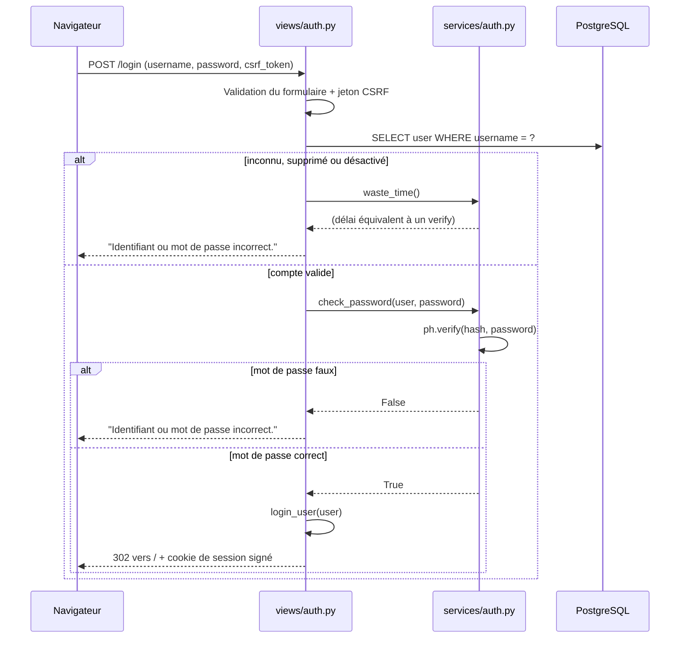
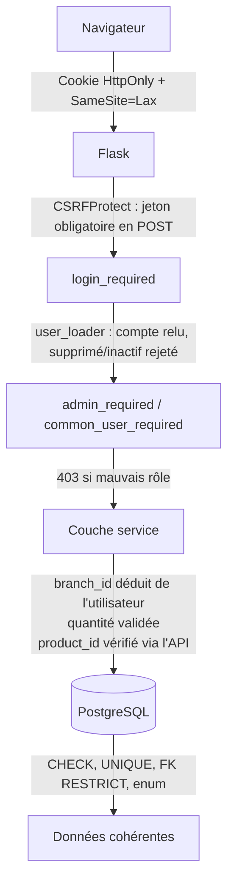

# Authentification et autorisation

Ce document décrit comment le Backoffice vérifie **qui** se connecte
(authentification) et **ce que** chaque rôle a le droit de faire
(autorisation), et justifie les choix techniques.

Fichiers concernés :
[`services/auth.py`](../backoffice/services/auth.py),
[`views/auth.py`](../backoffice/views/auth.py),
[`decorators.py`](../backoffice/decorators.py),
[`app.py`](../backoffice/app.py).

## 1. Stockage des mots de passe

### Mécanisme retenu : Argon2

Le hachage utilise **Argon2** via la bibliothèque `argon2-cffi`, avec les
paramètres par défaut de `PasswordHasher()` (variante **Argon2id**).

Argon2 est le lauréat de la *Password Hashing Competition* (2015) et la
recommandation actuelle de l'OWASP. Contrairement à bcrypt ou PBKDF2, il
est **coûteux en mémoire** autant qu'en temps de calcul, ce qui neutralise
l'avantage des attaquants équipés de GPU ou d'ASIC : paralléliser des
milliers de tentatives exige de multiplier la RAM, pas seulement les
cœurs.

### Comment un mot de passe est haché

```python
from argon2 import PasswordHasher
ph = PasswordHasher()
password_hash = ph.hash(password)   # services/users.py, seed.py
```

`hash()` génère un **sel aléatoire** à chaque appel et retourne une chaîne
autodescriptive :

```
$argon2id$v=19$m=65536,t=3,p=4$c29tZXNhbHQ$RdescudvJCsgt3ub+b+dWRWJTmaaJObG
 └ variante  └ ver └ paramètres  └ sel      └ hash
```

Tout est dans la chaîne : la variante, la version, le coût mémoire (`m`),
le nombre d'itérations (`t`), le parallélisme (`p`), le sel et le hash.
Aucune colonne supplémentaire n'est nécessaire, et les paramètres peuvent
être durcis plus tard sans invalider les hashs existants - `verify()` lit
ceux qui sont inscrits dans la chaîne.

Le résultat est stocké dans `users.password_hash` (`varchar(255)`). Le mot
de passe en clair n'est jamais écrit, ni en base, ni dans les logs.

### Comment la vérification fonctionne

```python
def check_password(user: User, password: str) -> bool:
    try:
        return ph.verify(user.password_hash, password)
    except VerifyMismatchError:
        return False
```

Un hash ne se déchiffre pas - l'opération est à sens unique. `verify()`
extrait le sel et les paramètres du hash stocké, recalcule le hash du mot
de passe saisi avec **exactement** les mêmes valeurs, puis compare les
deux résultats en **temps constant** (la comparaison ne s'arrête pas au
premier octet différent, ce qui empêcherait de deviner le hash octet par
octet en mesurant le temps de réponse).

`argon2-cffi` lève une exception au lieu de retourner `False` ; on
n'intercepte que `VerifyMismatchError` (mot de passe faux). Un hash
corrompu ou illisible remonte donc en erreur 500 au lieu d'être
silencieusement traité comme un mauvais mot de passe : une base abîmée
doit être visible, pas confondue avec une faute de frappe.

### Pourquoi SHA-256 seul ne suffit pas

SHA-256 est une fonction de hachage **généraliste**, conçue pour être
**rapide** - c'est exactement le défaut recherché ici. Quatre problèmes,
et Argon2 les traite tous les quatre :

| Problème | Avec SHA-256 seul | Avec Argon2 |
|---|---|---|
| **Vitesse** | Un GPU calcule des **milliards** de SHA-256 par seconde. Un mot de passe de 8 caractères tombe par force brute en quelques heures. | Chaque essai coûte ~50 ms et plusieurs dizaines de Mo de RAM. La même attaque prend des siècles. |
| **Pas de sel** | Deux utilisateurs avec le même mot de passe ont le **même hash** : la fuite de la base révèle immédiatement les comptes qui partagent un mot de passe. | Sel aléatoire par mot de passe : deux hashs identiques n'existent pas. |
| **Tables précalculées** | Les *rainbow tables* et les bases de hashs SHA-256 connus permettent de retrouver un mot de passe courant par simple recherche. | Le sel rend tout précalcul inutilisable : il faudrait une table par sel. |
| **Matériel dédié** | Les ASIC de minage calculent du SHA-256 à un coût dérisoire. | Le coût mémoire d'Argon2 rend ce matériel inefficace. |

Le résumé : *un hash rapide est une faille quand on hache un secret à
faible entropie*. SHA-256 est le bon outil pour vérifier l'intégrité d'un
fichier, pas pour stocker un mot de passe. Argon2 est délibérément lent -
imperceptible pour un utilisateur qui se connecte une fois, prohibitif
pour un attaquant qui essaie des millions de combinaisons.

### Protection contre l'énumération de comptes

Argon2 étant lent par conception, il crée un canal de fuite involontaire :
si un identifiant inconnu renvoie une erreur **immédiate** alors qu'un
identifiant valide met 50 ms (le temps du `verify`), la différence de
latence révèle quels comptes existent.

`services/auth.py` neutralise cette fuite :

```python
_DUMMY_HASH = ph.hash("dummy-password-anti-enumeration")

def waste_time() -> None:
    try:
        ph.verify(_DUMMY_HASH, "wrong")
    except VerifyMismatchError:
        pass
```

Quand l'identifiant est inconnu, supprimé ou désactivé, `views/auth.py`
appelle `waste_time()` avant de répondre. La réponse prend alors le même
temps qu'une vraie vérification. Le hash factice est calculé **une seule
fois** au chargement du module, pour ne pas ajouter le coût d'un `hash()`
à celui du `verify()`.

Le message d'erreur est également identique dans tous les cas -
« Identifiant ou mot de passe incorrect. » - sans jamais préciser lequel
des deux est faux.

## 2. Authentification

### Choix : sessions plutôt que jetons

Le Backoffice utilise une **session côté serveur** portée par un cookie
signé, via **Flask-Login**. Ce n'est pas un JWT.

Justification :

| Critère | Session + cookie signé | JWT |
|---|---|---|
| **Adéquation** | Le Backoffice est rendu côté serveur (Jinja). Le navigateur envoie le cookie automatiquement, sans une ligne de JavaScript. | Il faudrait stocker le jeton côté client et l'attacher à chaque requête - donc du JS, pour une application qui n'en a pas besoin. |
| **Révocation** | **Immédiate.** Le `user_loader` recharge l'utilisateur depuis la base à chaque requête. Un compte supprimé perd l'accès à la requête suivante. | Un JWT est valide jusqu'à son expiration. Le révoquer avant exige une liste noire côté serveur - c'est-à-dire réintroduire l'état qu'on voulait éviter. |
| **Stockage du secret** | Cookie `HttpOnly` : inaccessible au JavaScript, donc au XSS. | En `localStorage`, un JWT est lisible par n'importe quel script injecté. |
| **Scalabilité** | Nécessite un état partagé entre instances. | Sans état, meilleur pour une API distribuée. |

Le seul avantage réel du JWT - l'absence d'état serveur - ne sert à rien
ici : le projet tourne sur une instance, et la consigne exige de
**rejeter les utilisateurs supprimés**. La révocation immédiate est donc
une exigence fonctionnelle, et c'est précisément le point faible du JWT.

### Durcissement du cookie

```python
app.config["SECRET_KEY"] = os.environ["SECRET_KEY"]
app.config["SESSION_COOKIE_HTTPONLY"] = True
app.config["SESSION_COOKIE_SAMESITE"] = "Lax"
app.config["SESSION_COOKIE_SECURE"] = (
    os.environ.get("SESSION_COOKIE_SECURE", "false").lower() == "true"
)
```

| Réglage | Effet |
|---|---|
| `SECRET_KEY` lue dans l'environnement | Signe le cookie. `os.environ[...]` sans valeur par défaut : l'application **refuse de démarrer** si la clé est absente, plutôt que de tourner avec un secret prévisible. |
| `HttpOnly` | Le cookie est invisible pour `document.cookie` : un XSS ne peut pas voler la session. |
| `SameSite=Lax` | Le cookie n'est pas envoyé sur les requêtes cross-site (hors navigation de premier niveau). Première barrière contre le CSRF. |
| `Secure` | Cookie transmis en HTTPS uniquement. Désactivé par défaut pour permettre le dev et les tests en HTTP, activable par variable d'environnement. |

Le cookie ne contient que l'`id` de l'utilisateur, signé. Il n'est pas
chiffré : c'est inutile, puisqu'il ne transporte aucun secret. La
signature garantit qu'il n'a pas été modifié.

### Cycle de connexion



Trois motifs de refus sont traités **avant** la vérification du mot de
passe : identifiant inconnu, `deleted_at` renseignée (soft delete),
`is_active = false` (compte désactivé). Un utilisateur supprimé ne peut
donc pas se connecter, même avec le bon mot de passe.

### Rechargement à chaque requête

```python
@login_manager.user_loader
def user_loader(user_id: str) -> User | None:
    with SessionLocal() as session:
        user = session.execute(
            select(User)
            .where(User.id == int(user_id))
            .where(User.deleted_at.is_(None))
            .where(User.is_active.is_(True))
        ).scalar_one_or_none()
    return user
```

C'est le point central de la révocation. Flask-Login appelle cette
fonction à **chaque requête authentifiée**, avec l'`id` lu dans le cookie.
Les deux filtres `deleted_at IS NULL` et `is_active IS TRUE` font qu'un
compte supprimé ou désactivé pendant qu'il est connecté voit sa session
invalidée immédiatement : le `user_loader` retourne `None`, et
Flask-Login le traite comme un anonyme.

Le rôle et la succursale sont eux aussi relus en base à chaque requête.
Ils ne sont **pas** stockés dans le cookie : un changement de rôle ou de
succursale prend effet aussitôt, et un cookie ne peut pas transporter un
rôle périmé.

### Protection des routes

Toute vue est décorée par `@login_required`, y compris le tableau de bord
`/`. Un visiteur anonyme est redirigé vers `/login`
(`login_manager.login_view = "auth.login"`). Il n'existe aucune route du
Backoffice accessible sans authentification.

La déconnexion (`/logout`) est en **POST uniquement**, protégée par CSRF :
un simple lien `GET` permettrait de déconnecter un utilisateur depuis une
page tierce.

## 3. Autorisation

Deux rôles, des périmètres **strictement disjoints** :

| Action | `admin` | `common` |
|---|---|---|
| Lister le stock de sa succursale | Refusé, 403 | Autorisé |
| Ajouter / retirer du stock | Refusé, 403 | Autorisé, sa succursale uniquement |
| Lister les utilisateurs | Autorisé | Refusé, 403 |
| Créer un employé | Autorisé | Refusé, 403 |
| Supprimer / (dés)activer un employé | Autorisé | Refusé, 403 |
| Changer le mot de passe ou la succursale d'un employé | Autorisé | Refusé, 403 |

L'administrateur **ne gère pas** de stock : la consigne l'exige, et le
schéma le garantit (`branch_id IS NULL` pour un admin, donc
`_user_branch_id()` lève `NoBranchAssigned`).

### Application côté serveur

L'autorisation repose sur des décorateurs appliqués à chaque vue, jamais
sur le masquage de boutons :

```python
def admin_required(view):
    @wraps(view)
    def wrapper(*args, **kwargs):
        if current_user.role != UserRole.ADMIN:
            abort(403)
        return view(*args, **kwargs)
    return wrapper
```

```python
@stock_bp.route("/stock/add", methods=["POST"])
@login_required
@common_user_required
def add_stock_view():
    ...
```

L'ordre compte : `@login_required` s'exécute en premier, ce qui garantit
que `current_user.role` existe quand le second décorateur le lit.

Les deux décorateurs testent l'égalité stricte (`!= UserRole.ADMIN`), pas
une appartenance à une liste. Un rôle ajouté plus tard serait refusé
partout par défaut, plutôt qu'autorisé par accident.

L'interface masque effectivement les actions non permises, mais ce n'est
qu'un confort : un `curl` sur `/users/new` avec la session d'un employé
reçoit un **403**, pas une page. C'est vérifié par
`tests/test_routes_authz.py` (10 tests).

### Isolation par succursale

Les fonctions de service ne prennent **jamais** `branch_id` en paramètre.
Elles le déduisent de l'utilisateur authentifié :

```python
def _user_branch_id(user):
    if user.branch_id is None:
        raise NoBranchAssigned(
            "Cet utilisateur n'est rattaché à aucune succursale."
        )
    return user.branch_id


def add_stock(session, user, product_id, quantity):
    branch_id = _user_branch_id(user)
    ...
```

Si `branch_id` était un paramètre, la sécurité dépendrait de chaque route
pensant à vérifier que l'utilisateur a le droit de nommer cette
succursale. Un oubli, et un employé modifierait le stock d'une autre
succursale en changeant un champ de formulaire caché.

En déduisant la succursale de l'utilisateur, la fraude n'est pas rendue
difficile : elle devient **impossible à exprimer**. Il n'y a aucun
paramètre à falsifier. L'autorisation n'est plus une vérification qu'on
peut oublier, c'est une propriété de la signature de la fonction.

`_user_branch_id()` **retourne** la valeur au lieu de se contenter de
vérifier, ce qui rend le contrôle impossible à contourner : sans lui, il
n'y a pas de `branch_id` avec lequel continuer.

Détail et cas limites : [`validation.md`](validation.md).

## 4. Protection CSRF

`CSRFProtect` (Flask-WTF) est activé globalement dans `create_app()`.
Toute requête `POST` doit présenter un jeton valide, lié à la session et
signé avec `SECRET_KEY`. Les formulaires l'incluent via
`{{ form.hidden_tag() }}`.

Sans ce jeton, un site tiers pourrait faire soumettre au navigateur d'un
employé connecté un formulaire vers `/stock/remove` - le cookie de session
étant envoyé automatiquement. `SameSite=Lax` limite déjà ce scénario, mais
le jeton CSRF est la protection qui ne dépend pas du comportement du
navigateur.

Toutes les mutations sont en `POST` - y compris les suppressions et les
(dés)activations, qui pourraient être tentées en `GET`. Une requête `GET`
ne modifie jamais l'état, ce qui la rend non déclenchable par un simple
lien ou une balise ``.

Cycle complet vérifié par `tests/test_security_csrf.py`.

## 5. Défense en profondeur

La sécurité ne repose pas sur une seule couche :



Chaque couche protège quelque chose que la suivante ne peut pas voir :

| Couche | Ce qu'elle garantit |
|---|---|
| Cookie | Le secret de session n'est pas volable par JavaScript. |
| CSRF | La requête vient bien de notre interface. |
| `login_required` + `user_loader` | L'utilisateur existe **encore** et est **encore** actif. |
| Décorateurs de rôle | Le rôle a le droit d'appeler cette route. |
| Couche service | L'opération est cohérente, et porte sur la bonne succursale. |
| Contraintes base | L'état stocké est valide, quel que soit le code qui écrit. |

## 6. Cloisonnement de l'accès IA

L'agent IA répond à des visiteurs **anonymes**. Il n'a par conséquent
aucun accès direct à la base : il passe par le Stock MCP Server, qui se
connecte avec le rôle PostgreSQL **`mcp_reader`**.

| | Backoffice | Stock MCP Server |
|---|---|---|
| Compte | `hbntory` (`DATABASE_URL`) | `mcp_reader` (`MCP_DATABASE_URL`) |
| `branches`, `stock` | lecture + écriture | **lecture seule** |
| `users` | lecture + écriture | **aucun accès** (`REVOKE ALL`) |

Le modèle SQLAlchemy du Stock MCP Server ne déclare d'ailleurs même pas la
table `users` : elle n'existe pas dans son univers.

L'intérêt est que la restriction est **structurelle**. Elle ne dépend pas
de la correction du code du serveur MCP : même un bug, une injection ou un
outil mal écrit se heurterait à un refus de PostgreSQL. Et comme aucun
outil MCP n'expose d'écriture, le stock ne peut être modifié que depuis le
Backoffice authentifié.

Le rôle est (re)configuré à chaque démarrage par
`configure_readonly_role()` dans `init_db.py`, ce qui garantit que ses
privilèges ne dérivent pas silencieusement.

## 7. Limites connues

- **`SESSION_COOKIE_SECURE` est `false` par défaut**, pour permettre le
  développement et les tests en HTTP. En HTTPS réel, il faut poser
  `SESSION_COOKIE_SECURE=true` dans l'environnement.
- **Aucune politique de complexité des mots de passe.** Les formulaires
  exigent un champ non vide, pas une longueur ni un jeu de caractères
  minimum. L'admin peut donc créer un compte avec un mot de passe faible.
- **Pas de limitation du nombre de tentatives de connexion.** Argon2 rend
  la force brute lente, mais rien ne bloque un attaquant persistant. Un
  verrouillage temporaire par IP ou par compte serait la suite logique.
- **Pas d'expiration de session explicite.** Le cookie est un cookie de
  session (effacé à la fermeture du navigateur), sans durée de vie
  absolue.
- **Un seul administrateur, non modifiable.** L'admin ne peut être ni
  supprimé, ni désactivé, ni changé de mot de passe via l'interface - une
  protection contre le verrouillage accidentel, mais aussi une rigidité
  assumée. Créer un second admin exige de passer par `seed.py`.
- **CORS ouvert (`allow_origins=["*"]`) sur l'AI Query Service**, parce
  que le Client Web est servi depuis une autre origine. Acceptable pour un
  service public en lecture seule et sans authentification, à restreindre
  en production.
- **Pas de rate limiting sur `/ask`.** Chaque question consomme du quota
  Gemini, sans plafond par visiteur.
